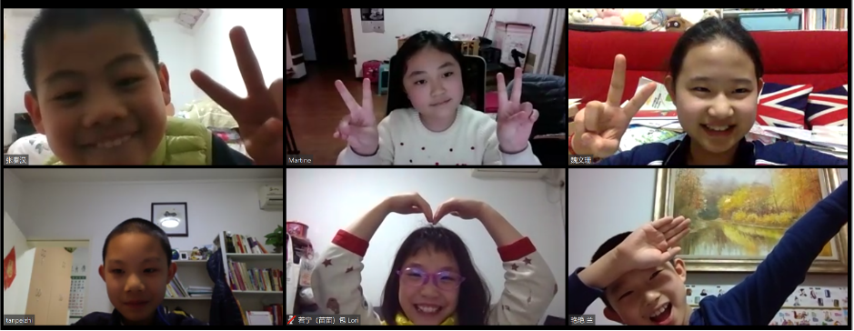

# 后记 

 

---

我叫包若宁，今年上小学四年级。

我学习编程，不是为了“会”这个结果，而是为了“学”这个过程。在向编程迈出第一步时，我是那么地生疏，这碰一下，那碰一下，小心翼翼，生怕程序崩溃。而现在，依然还是那双手，在键盘上飞快地敲打着，再也听不出胆怯了。

现在我知道了编程要脚踏实地，检查精细，有一点错计算机就会不客气。可如果程序写对了，计算机又会给你意外的惊喜。我想，有一天，这些程序会被我们用更简洁、更精炼的计算机语言表达出来，那时候的惊喜又会是什么样呢？

如今编程成为了我与计算机交流的一个渠道。调皮的小黄猫、可爱的阿尔法笨熊、会飞的骏马……屏幕上这些天真可爱、活灵活现的角色好像都是活的，都是我的好伙伴。它们一直陪伴着我，使我沉浸在奇妙的程序中，让我感到无比快乐。

我最大的愿望是能做出3D的虚拟世界，那时不要只给这些角色一个机械的大脑，而是要能让它们能一点点地“学”，一点点地积累经验。终有一天，这些角色能出现在我面前，能和我握手、交谈甚至互相学习。

    ---包若宁 中关村一小 四年级1班

---
我叫卜文远，今年10岁了；我喜爱数学和编程。

从我二年级起，我爸爸和包老师、兰老师组织了一个“SIGMA数学与编程特别兴趣组”：爸爸妈妈们是老师，我们计算所六个孩子是学生。

爸爸妈妈们用“启发式教学法”教，讲得很慢，往往两个小时只讲一道题；我们用“自由讨论”方式学，明白了数学方法背后的根本。

三年级时，我猜想“三角形、六边形、十二边形，……，边数越多，越接近圆”；然后我就自己编写Scratch程序，画出正10000边形，算出圆周率π=3.141593；后来爸爸说这就是“刘徽割圆法”。

我纯粹自发地想出了古人的方法！这让我非常兴奋，也体会到了“发现的乐趣”！

我还自主发现了：因子的因子还是因子。比如4是16的因子，而2是4的因子，则2也是16的因子。爸爸教我严谨地证明了我的发现---这是我自己的第一个定理。

我写了36个Scratch程序，包括“打圆形靶子估计π”、模拟“牛顿的大炮”画抛物线和椭圆等。编程让我能“画出”想法，这让我很高兴。

我们把学习历程记录下来，就是这本书。在学Scratch前，我只是一道光；在学了Scratch后，我还是一道光，只不过这道光充满了勇气、智慧和自信！

我的理想是成为一名科学家；我在为此而努力！

    ---卜文远 中关村一小 四年级9班

--- 

大家好，我叫傅鼎荃，我今年10岁。

当我一开始接触Scratch的时候，我觉得很新奇，一开始看到各种的积木块，只用轻轻的拖动积木块就能实现一个游戏，这实在是太神奇了！但我才发现我想的太乐观了。虽然意思我都搞明白了，但是做一套程序还是要花费我几堂课的时间。

我印象最深的一套程序，当属阿尔法小狗了，这一套程序十分复杂，有许多变量和列表，那么多积木块我写的手都麻了。但是当我看到最后的成果时，我感觉一切都值。

那个小狗实在太聪明了，我一共和他玩了几十局，平了几十局，输了三局！太丢人了。后来我仔细想了一下，机器很善于枚举法，而且这道题目和枚举法也有很大关系，机器可以枚举所有的可能性，而其中一种可能性就是我走的。这样仔细一想，机器人还真是有理有据赢的。

我心里想就这这么一个小小的Scratch程序，机器的计算能力就如此惊人，而如果放到现实中的大型计算机中，把地球的重大事件给放进去，那它有可能就可以模拟整个世界了！我想机器的搜索范围如此之大，而人类思考的深度又如此之深，他们各有各的优点如果他们联合起来，该会比以前的效率提高好几百倍吧！
	
    ---傅鼎荃 北大附小 四年级10班 

---

我学习Scratch的感受可以用几个字概括：新奇，有趣，好玩。因为学习Scratch，第一次动手操作电脑，一切都很新奇；在学习过程中，本不爱思考的我在老师们的引导下茅塞顿开，感觉Scratch很有趣，通过学习我的数学思维能力也有所提高。在应用方面，无论是用Scratch画椭圆，估计Pi，掷骰子，解决鸡兔同笼问题，幻方，还是阿尔法狗下棋，都非常好玩。

在爸爸妈妈的指导与帮助下，我仿照《三国演义》电视剧主题曲改编了一下歌词，请您指教：

    ---谭沛之 中关村一小 五年级11班

---

这是一段难以忘怀的学习经历；这是一篇发自肺腑的的课后感言。

10岁那年新冠疫情爆发，学生们都采用居家隔离的方式进行学习与防护，那我除了学校的学习还能干什么更有乐趣的事情呢？在卜校长的引领下，我和小伙伴们一起学习Scratch编程；我们每日学习、讨论与沟通，并且花了大量的时间把编程学习的要点、看法和内容用简练的语言和清晰的观点做以梳理和呈现，一起完成了我们这本学习笔记。

我喜欢Scratch的原因不是对自己有了一项新技能而感到满意，不是学成后和同学们有炫耀的资本，而是寻觅到我感兴趣的知识，经过不断探索，不停改进后得到的结果经常会让我喜出望外。

我理解的编程主要通过编程语言，实现预期的效果。编程语言学起来不是很难，我理解的编程语言和日常人的语言一样，只是缩写并高级化了，比如日常语言“A是1”，在编程语言中变成”A设为1”，这种语言我也是适应了好长一段时间，起初我知道怎么做但是就是在编程方块里找不着，过了七八天我有了一些编程的经验逐渐熟练之后，也就对编程语言驾轻就熟，能快速找到每个方块，也是学习中量变引起质变一个小小的案例吧。

通过编程学习，锻炼了我的专注力和思维逻辑能力，也让我知道有努力就会有回报---你把思考献给代码，代码就会把效果还给你。

我希望你读了这本书也一样逐渐喜欢上Scratch编程，去用思维的火花照亮生活中的每一天！

    ---魏文珊 中关村一小 四年级8班

---

我发现我对编程很感兴趣，每次打开电脑，我都会编个小游戏，然后跟爸爸妈妈一起玩儿。

当我用自己编写的阿尔法小狗程序下棋的时候，发现小狗特厉害，玩了十局，小狗竟然没输过，我深深地被小狗的能力震撼到了。

我相信如果计算机有意识，它会自己编程增加自己的功能，那么计算机的思想肯定会超过人类。
    
    ---张秦汉 双榆树中心小学 三年级4班

----
## 撰写人

包若宁：第4讲、第11讲、第17讲、第20讲、第21讲

卜文远：第1讲、第2讲、第23讲、第25讲、第27讲

傅鼎荃：第8讲、第13讲、第19讲、第28讲、第29讲

魏文珊：第5讲、第9讲、第15讲、第24讲

谭沛之：第7讲、第10讲、第16讲、第18讲、第30讲

张秦汉：第3讲、第6讲、第12讲、第14讲、第22讲、第26讲

## 审校

卜东波 中科院计算所 研究员

包云岗 中科院计算所 研究员

兰艳艳 清华大学教授、前中科院计算所研究员

谭光明 中科院计算所 研究员

张春明 中科院计算所 副研究员

何海芸 微软中国有限公司 资深软件开发工程师

张国强 南京师范大学计算机学院 教授

## 封面设计

刘卫玲 中科院计算所 高级工程师

[返回上级](index.md)
