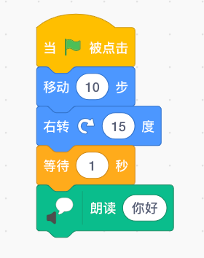
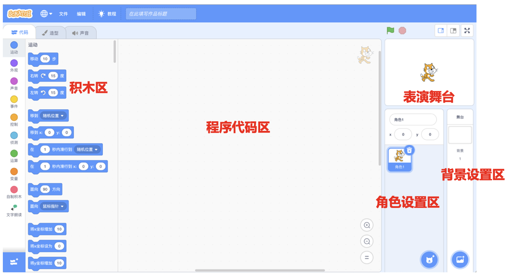
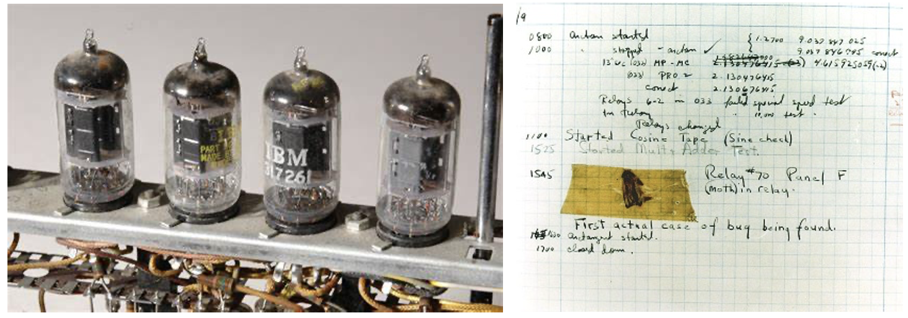

# 第一讲 什么是计算机程序？

什么是计算机程序？计算机程序啊，就是用计算机能够听得懂的语言说的一段话。我们就从计算机语言谈起吧！

## 一、什么是计算机语言？

人类之间交流信息，主要手段是“语言”。

不同人群用的语言也不同。比如我们中国人日常交流通常用汉语，与美国人打交道则要用英语。那要是我们和计算机打交道呢？说汉语、英语计算机可听不懂，得说“计算机语言”，计算机才能懂。

人类的语言有很多种；计算机的语言也有很多种。我们这里要讲的是Scratch语言，用这种语言说的一段话看起来是这样子的：
 

图1-1  用Scratch语言说的一段话

计算机能够听懂这段话；它的意思是：当绿旗被点击时，一只小猫（Scratch的默认角色）向前移动10步，再右转15度，；然后等待1秒，最后说“你好”。

我上网查了资料，Scratch是由美国MIT大学米奇·雷斯尼克（Mitchel Resnick）领导的“终身幼儿园团队”开发的免费、开源的编程系统，特点是图形化编程，通过拖拽、拼搭积木的方式，就能编写程序啦！就像在玩乐高积木！

Scratch图形、声音等素材丰富，适合中小学生来学习。用Scratch语言，你能够表达你的想法，还能够帮你解决一些数学难题，是不是很好啊？

还有其他的计算机语言吗？当然有啦！卜老师说还有Python、C++、Java等，都是计算机语言。等我们长大再学吧！ 

## 二、怎样让计算机听懂Scratch语言？

要让你的计算机听懂Scratch语言的话，你得给它配个“Scratch语言翻译官”。这个翻译官可以这样下载：

（1）Scratch的官方网站
从[https://scratch.mit.edu/download](https://scratch.mit.edu/download)下载。

图1-2 MIT大学的Scratch官方网站

我用的电脑是Mac笔记本，所以我点击了图1-2的MacOS图标；如果你的电脑是Windows系统的话，你需要点击Windows图标。我们用的是Scratch3.0版本。

（2）Scratch的国内镜像网站
从[https://scratch.cf/](https://scratch.cf/)下载，如果无法访问Scratch官方网址的话，可以访问它的国内镜像网址。

（3）国产的Scratch编程平台
Scratch源代码已开源了，国内团队基于这些源代码做了进一步开发，比如“慧编程”系统，也是一个很好的Scratch翻译官，可以从[https://mblock.makeblock.com/zh-cn/](https://mblock.makeblock.com/zh-cn/)下载安装使用。

如果你不想在自己的电脑上安装Scratch翻译官的话，也没关系；MIT大学已经有一台听得懂Scratch语言的机器，网址是[http://scratch.mit.edu](http://scratch.mit.edu），可以用浏览器直接访问并使用。进入这个网站之后，点击“Start Creating”就可以编程啦！如果你访问不了这个网址的话，也可以用[“慧编程”的服务器](https://ide.makeblock.com/)。

## 三、什么是计算机程序？

用计算机语言说的一段话，就是计算机程序。换句话说，要让计算机干活儿，就得告诉它“指令”，计算机根据指令做动作；这些指令串起来就是程序。

Scratch程序就更加形象了：里面有角色，有舞台；角色根据脚本在舞台上表演。这个脚本就是程序。图1-1就是一段Scratch程序：Scratch程序默认会有一个角色，是一只小猫；这段程序的意思是指挥小猫移动、右转、等待。很好玩吧？

## 四、Scratch编程环境简介
用安装的Scratch语言翻译器能直接编写程序。这个翻译器由以下5部分组成：积木区、程序代码区、表演舞台、角色设置区和背景设置区。

图1-3 Scratch编程平台的界面

详细内容，请仔细阅读一下书吧。

## 六、一个复杂一点儿的Scratch程序：托球游戏

### 动手练：托球游戏

#### 实验目的：托球游戏游戏是这么玩儿的：

  游戏里有一个弹力球从上方下落；玩家用鼠标移动一个板子，去托球，尽量不让球落地。球如果碰到板子或舞台边缘，就会反弹；如果球没被接住，落到了地板上，那么游戏终止。

图1-12 托球游戏

#### 代码下载及Web版

点击[托球游戏的代码](Code/第1讲-托球.sb3)下载于本地运行，或点击[托球游戏Web版](https://scratch.mit.edu/projects/682579728/)直接运行

## 十、教师点评
孩子们的第一堂课就写了这个托球的游戏，玩得非常高兴，积极性一下就 调动起来了。拖曳式编程易于上手，程序运行结果一目了然，这是 Scratch 非 常显著的优点!

我们在授课时把程序比喻成“角色的脚本”，孩子们很容易理解和接受。 从笔记来看，孩子们已经理解并掌握了这一点。

在这一讲里，我们把拖曳、拼接积木的过程描述得比较清楚，在后续的章节里，将简化描述，不再这么啰嗦了。 

图1-13 早期计算机里用的电子管（左）和计算机程序里的第一个Bug（右）

图 1-14 Grace Hopper 工作照(源自 https://en.wikipedia.org/wiki/Grace_Hopper)

我们还给孩子们补充了一些有趣的历史:发现第一个 bug 的人是鼎鼎大
名的女程序员 Grace Hopper，那台机器也大名鼎鼎，就是 Mark I 型计算机。 Grace 是个传奇人物:她于 1934 年获得博士学位。在日本轰炸珍珠港之后， Grace 决定加入美国海军陆战队，并在那里负责 Mark I 型计算机的编程和维 护。她提出了第一个编译器 A-0，使得能够“用英文单词进行编程”，而不再 用普通人看不懂的机器码编程。她还设计了 COBOL 语言，被称为“ COBOL 之母”。

小 SIGMA 数学特别兴趣组里的孩子们听到事迹很受鼓舞，我们希望读到 这本书的你也能受到鼓舞。

[返回上级](index.md)
