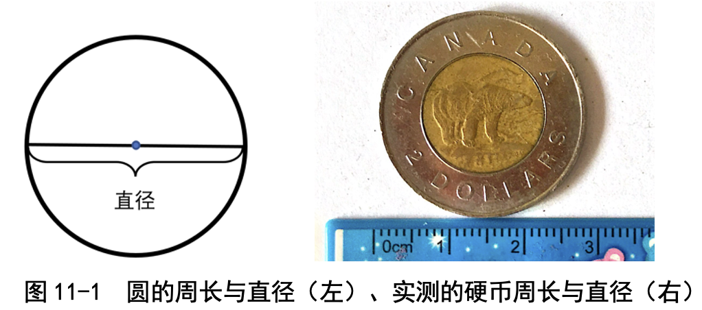
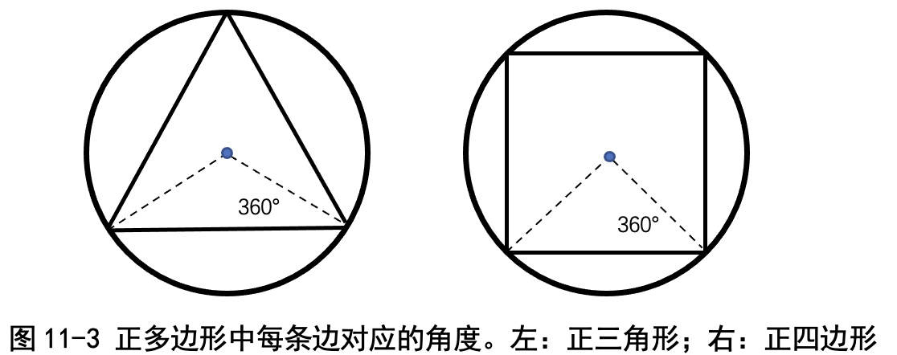
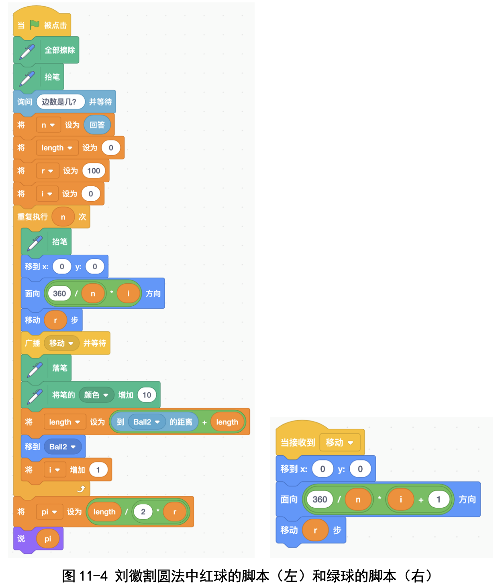
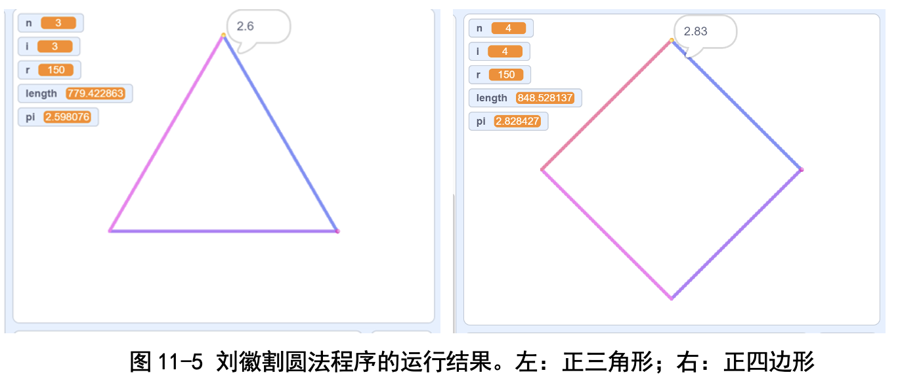
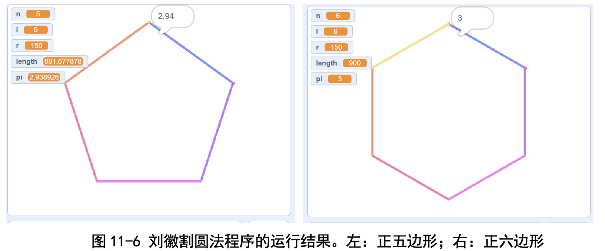
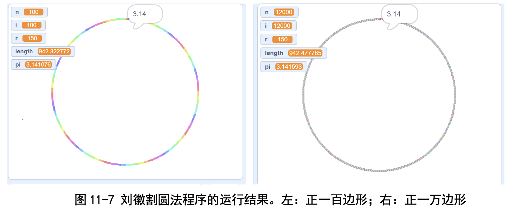
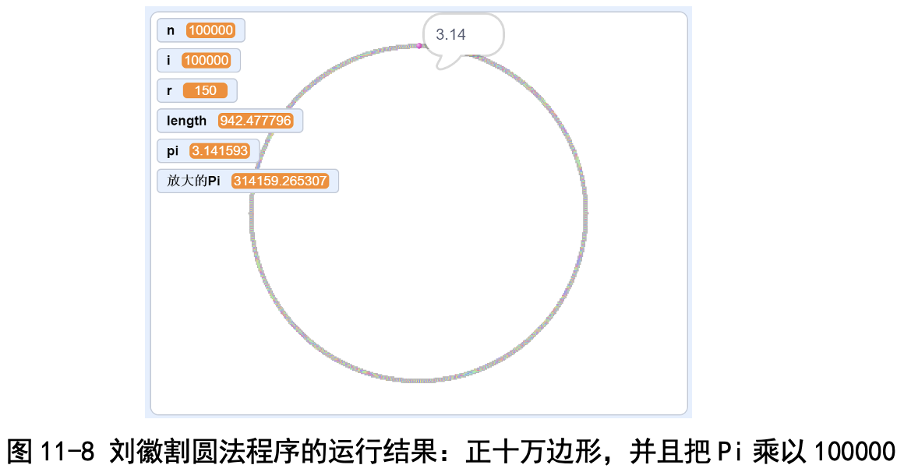
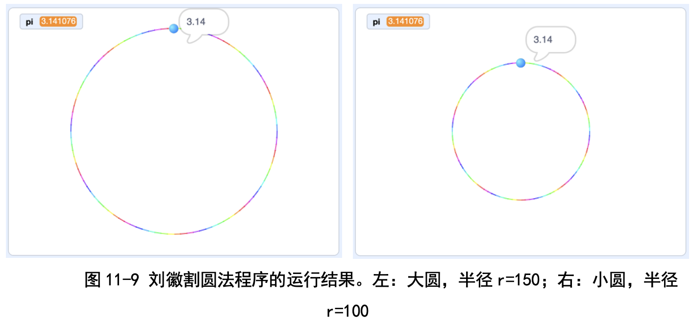

# 第11讲 逐级逼近法:刘徽割圆法估计π

## 一、实验目的

今天是2020年3月14日，是“数学节”。之所以这天被选中作为数学节， 是因为“3.14”是圆周率π的前 3 位数字，而π非常重要，足以代表数学。

今天，我们就编程计算一下π的值吧。

## 二、背景知识

**（1）	π 是什么?** 

我们从小学三年级就知道 π 就是圆周率，就是“圆的周长 ÷ 直径”。周 长，顾名思义，就是圆的一周的长度;而直径呢，就是先画一条直线穿过圆 心，和圆相交的两个点之间的线段的长度就是直径了。

**（2）	π 是多少?** 

古代人说“周三径一”，意思是说一个圆的直径是1尺时，周长就是3尺， 换句话说，古时计算的圆周率 π 等于 3。

我自己找了一枚圆圆的硬币，用尺子量了一下直径，是 2.8cm ;又用了一 根线绕圆一周，量量长度，周长是 9.0cm ;通过计算两者之比，我估计出圆周率是 π≈9.0÷2.8≈3.21(见图 11-1)。当然了，这是很粗糙的估计;现在人们 已经算得非常精确了:π=3.1415926...，是一个无穷无尽、写也写不完的数， 还不会出现循环。

一个数无穷无尽还不重复，这很奇怪;我们现在上四年级，见到的小数要么是 有限长度的，比如 1÷2=0.5，小数点后只有一位数字;要么是无限循环小数，比 如 1÷3=0.333...，虽然是无穷无尽的，可是小数部分一直是 3，是一个循环小数。

像 π 这样有无限位数又不循环的小数，真的很奇怪;老师告诉我们，这叫 “无理数”。老师还特意强调:这里的“理”不是“道理”的意思，而是“比例”
的意思;无理数不是“没有道理的数”，而是“不能表示成两数之比的数”。初 学者往往会望文生义，现在就得纠正。

**（3）	怎样找一个数尽量接近 π ?** 

π 太复杂了，那能不能找一个数与之近似呢?我国南北朝时期(比唐朝还早) 的大数学家祖冲之找到了两个数，都跟 π 很接近，一个叫约率，另一个叫密 率。老师提醒我们说:“这两个数都是有理数，祖冲之是用有理数近似无理数。”

......

**（4）	刘徽割圆法估计 π** 

那祖冲之是怎样得到 π 的近似值的呢?

这个还缺乏明确的历史文献佐证。不过研究数学史的人猜测祖冲之是采用 “刘徽割圆法”估计出 π 的。今天我们就用刘徽割圆法算一算 π 吧!

刘徽割圆法非常好理解:圆的周长不好算，但是多边形的周长好算啊，咱 们就用多边形的周长代替圆的周长吧。比如图 11-2 中的六边形(绿色的)，看 起来有点像圆了，不过还有一点差别，咱们就再多一点儿，用十二边形(蓝色 的)，就更像圆了。再多一点儿，用二十四边形(黄色的)，就跟圆非常像了。 老师提醒我们，这里的六边形是“正六边形”，就是各条边的长度都相等。据 考证，刘徽用正 96 边形估计出 π 等于 3.1416。

这个方法很直观，我也想到了这个“逐渐逼近圆”的方法:从三角形开始，四 边形，五边形，......，逐渐增加，不断逼近圆，越来越像圆。卜老师告诉我们，大 家发现了正多边形不断逼近圆，这个发现反过来说，就是圆是正多边形的极限。

想出这个方法的时候，我兴奋极了。后来才知道刘徽早在三国时期(约 1800 年前)就知道了。说起三国，我过去只会想起刘备、关羽、张飞和诸葛 亮，现在我还会想起刘徽。

......

详细内容请阅读书的第11讲。

## 三、基本思路

想用刘徽割圆法算出 π，第一步得画出正多边形，第二步得计算正多边形 的周长。我们一步一步来吧。

**（1）	画正多边形** 

要画正多边形的话，我们得先把顶点定下来。那怎样确定顶点呢?

咱们从最简单的做起吧。先看正三角形(也常称作等边三角形):绕圆一周 会旋转 360°，那三角形的一条边应该对应 360÷3=120° ;所以，我们从原 点出发，沿着 0°方向走半径那么远，就会到达第一个顶点;再回到原点，从 原点出发，沿着 120°方向走半径那么远，就会到达第二个顶点;从原点出发， 沿着 240°方向走半径那么远，就会到达第三个顶点(见图 11-3)。

类似地，要画正四边形的话，一条边应该对应 360÷4=90°，因此只要沿 着 0°，90°，180°，270°走半径那么远，就能把 4 个顶点确定下来了。

看完这两个例子，我们对一般的正多边形也会画了:假如边数是 n，我们 就先计算 360÷n 是多少度，然后从 0°开始，每次增加 360÷n 度，从原点出 发走半径那么远，就到达顶点了。

在确定了顶点之后，画多边形就容易了:我们利用 Scratch 的画笔功能， 从第一个顶点走到第二个顶点，就能把第一条边画出来;从第二个顶点走到第 三个顶点，就能把第二条边画出来;其他的边依次类推。

**（2）	计算正多边形的边长** 

这个比较简单:Scratch 里“侦测”栏里有一个“到鼠标指针的距离”积木: 我们把“鼠标指针”改成一个角色，就能得到两个角色之间的距离。比如，我 们设置两个角色，让角色 1 走到第一个顶点，让角色 2 走到第二个顶点，然后 让角色 2 计算“到角色 1 的距离”，就能够得到两个顶点之间的距离了。把所 有边的长度累加起来，就能得到多边形的周长了。

**代码下载** 

[刘徽割圆法的代码](Code/第11讲-刘徽割圆法.sb3) 

## 六、实验结果

**(一)随着正多边形边数(n)的增加，π 的估计值的变化**

(1)三角形，n=3，π 的估计值为 2.598076。 

(2)正方形，n=4，π 的估计值为 2.828427。 

(3)正五边形，n=5，π 的估计值为 2.938926。 

(4)正六边形，n=6，π 的估计值为 3。 

(5)正一百边形，n=100，π 的估计值为 3.141076。 

(6)正一万边形，n=10 000，π 的估计值为 3.141593。

如图 11-5~图 11-7 所示，随着正多边形边数的增加，得到的图形越来越 像圆了，估计出的圆周率也来越准。后面就不介绍了，因为后面得出的全部都 是 3.141593 这个值。

为什么边数再增加，程序算出来都始终是 3.141593，不再更新了呢?老师 告诉我们，这是因为 Scratch 算边长的时候，小数点后只能显示 6 位数字。于 是我们想了个办法:把结果 pi 乘以 100000，得到 314159.265307(见图 11-8)， 这样就又精确了 4 位小数“2653”。

**(二)大圆小圆的结果一样吗?**
网上的资料说，刘徽当年是用半径 1 尺的圆计算圆周率的。这里我改变了 半径，一个是半径为 150 的大圆，另一个是半径为 100 的小圆，我们看一看大 圆小圆计算出的结果是否一致，得到的结果如图 11-9 所示。

我发现不管是大圆还是小圆，算出来的结果都是 3.14076，基本上是一 样的。

## 七、教师点评

π 是非常重要的数。孩子们在 3 月 14 日这一天，通过编程自己亲手把 π 算出来，这很有意义。

用多边形近似圆，孩子们自己(比如卜文远同学)也有这个朦胧的想法; 最后画出来的正一万边形、正十万边形越来越像圆，估计出的 π 越来越精确， 孩子们非常兴奋!

当然了，本章的估计方法没有用到刘徽割圆法的“迭代”过程，这是一个 缺陷，这也是受限于小学生的知识储备，不得不做出的让步。

除了编程实现之外，我们还给孩子们补充了如下知识:

**(一)为何叫“割圆法”?哪里体现了“割”?**

以正六边形为例，割圆法就是把圆分割成 6 份，用 6 个小三角形近似圆。

刘徽割圆法的核心之一在于“正多边形面积的迭代计算方法”，是讲怎样 “根据正 n 边形边长计算正 2n 边形的面积”。刘徽的原话是“以六觚之一面乘 半径，因而三之，得十二觚之幂;若又割之，次以十二觚之一面乘半径，因而
六之，则得二十四觚之幂”，也就是:

**正十二边形的面积 = 正六边形边长 ×3× 半径** 

**正二十四边形的面积 = 正十二边形边长 ×6× 半径** 

其中的道理很简单:你看图 11-2，正十二边形就是正六边形外加 6 个小三角
形;为了求正十二边形的面积，刘徽先把正六边形切成 6 个大三角形，摆放成类似 长方形的样子，再补上那 6 个小三角形，就得到一个完美的长方形了(长方形中有 一个小三角形被分开显示了)。这个长方形的长是正 6 边形边长 ×3，宽是半径。

刘徽割圆法使用勾股定理，先计算正十二边形的边长，然后计算出正 二十四边形的面积，再应用勾股定理计算正二十四边形的边长，进而计算出正 四十八边形的面积。这样由边长算面积，再由面积算边长，不断进行，就能不 断逼近圆的面积了。

**(二)本讲采用的方法与刘徽割圆法的差异**

(1)刘徽割圆法是“用多边形的面积逼近圆的面积”，我们这里为了便于 编程实现，没用面积，而是使用“多边形的周长逼近圆的周长”。

(2)用面积的好处是可以“两侧逼近”，即刘徽使用内接正多边形，面积 始终比圆的面积小，同时在这个正多边形外边附加了一些矩形，总面积比圆的 面积大，这样同时算出两个数，一个比 π 大，另一个比 π 小。

我们这里只用了内接正多边形的周长，只做到了单侧逼近，即算出来的这 个数虽然接近 π，但始终比 π 小。做两侧逼近，需要用到勾股定理，我们留给 高年级的小朋友们思考和尝试。

(3)刘徽是从正六边形开始，每次倍增，作正十二边形、正二十四边形 等。我们这里用的是正三边形、正四边形、正五边形等，这个影响其实不大。 历史上，赵友钦割圆法也是用的正四边形。

**(三)刘徽和祖冲之的生平**

刘徽是淄乡(今山东邹平市)人，生活在三国和魏晋时期;他为《九章算 术》做注，提出用割圆术计算圆周率的方法。刘徽的名言“割之弥细，所失弥 少，割之又割以至于不可割，则与圆合体而无所失矣”，精辟地描述了割圆法 的迭代过程。

祖冲之，字文远(卜文远知道后非常兴奋)， 出生于建康(江苏南京)， 是南北朝时期人，比刘徽小大约 200 岁。他在刘徽割圆法的基础上继续改进，首 次将圆周率精确到七位数字，即在 3.1415926 和 3.1415927 之间。

最后再补充一点:古时候还没有小数点，小数是用分数来表示的。古人在 没有现代便利的阿拉伯数字表示方式的情况下还能算得这么精确，真是值得 钦佩!

[返回上级](index.md)
