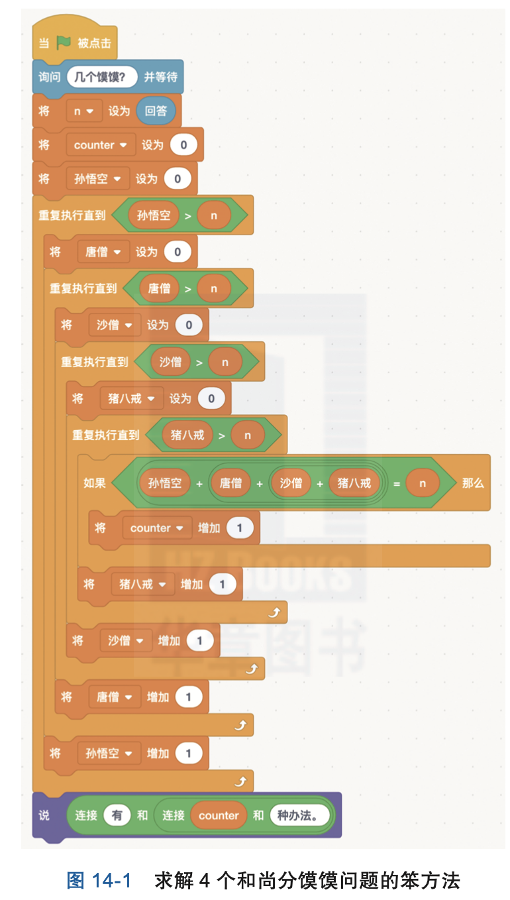
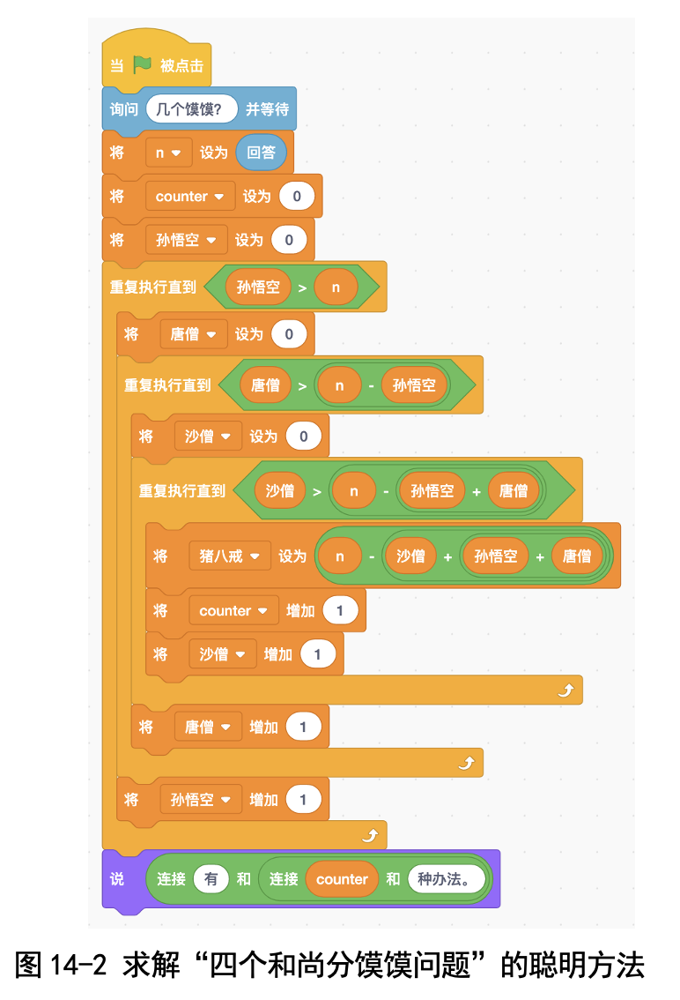
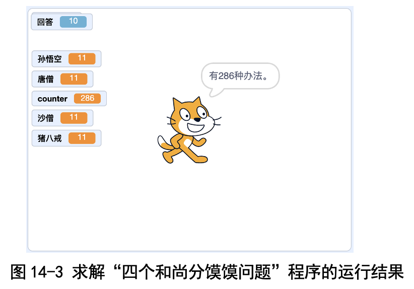

# 第14讲 从最简单的做起：四个和尚分馍馍

## 一、实验目的
唐僧师徒四人取经路上，孙悟空化缘化到了10个馍馍。师徒4人分馍馍，每人可以吃0，1，2，…或10个（我们约定不允许吃0.5个等分数个馍馍）。

请问共有多少种分法？我们写程序求出来吧！

## 二、基本思路
碰到复杂问题怎么办?卜老师一再强调:遇到复杂的问题直接做往往有 困难，我们就先考虑最简单的情形，看最简单的情形会不会;如果最简单的 情形我们都不会做，那就可以直接放弃了。

假如最简单的情形我们会做了，那下面就要考虑怎样把复杂的问题归纳 成简单的问题，也就是递归。因此，“从最简单的做起”往往和“递归”是紧 密联系在一起的。后来卜老师又通过“河内塔”游戏、斐波那契数列为我们 详细讲解了递归。

拿这个例子来说，4 个和尚分馍馍直接做不好做，那就先考虑简单的情 形:孙悟空和唐僧两个和尚分馍馍的问题，这就简单多了;然后考虑孙悟 空、唐僧、猪八戒 3 个和尚分馍馍的问题;最后再考虑 4 个和尚分馍馍的 问题。

## 三、编程步骤

### (一)角色设计
这里我们只设置一个角色，就用小猫吧。

### (二)变量设计
● Tang:唐僧分到的馍馍数。

● Sun:孙悟空分到的馍馍数。

● Zhu:猪八戒分到的馍馍数。

● Sha:沙和尚分到的馍馍数。

● counter:表示所有可能的分法。 ● n:一共有几个馍馍。

### (三)过程描述与代码展示

#### (1)2 个和尚分馍馍的求解过程(唐僧先吃，然后孙悟空吃): 

先看最笨的方案:Tang 从 0 枚举到 n，Sun 从 0 枚举到 n ;判断条件是
Tang+Sun=n。

咱们改进一下:Tang 从 0 枚举到 n，Sun 不用枚举，可以直接算出来:
Sun=n-Tang，就是剩下几个孙悟空吃几个。

#### (2)3 个和尚分馍馍的求解过程(唐僧先吃，然后孙悟空吃，最后猪八戒吃):
先看最笨的方案:Tang 从 0 枚举到 n，Sun 从 0 枚举到 n，Zhu 从 0 枚 举到 n;判断条件是 Tang+Sun+Zhu=n。

咱们改进一下:Tang 从 0 枚举到 n，Sun 从 0 枚举到 n-Tang，Zhu 不 用枚举，可以直接算出来 Zhu=n-Tang-Sun。

#### (3)4 个和尚分馍馍如何求解?这跟 3 个和尚分馍馍很类似! 

先看最笨的方案:Tang 从 0 枚举到 n，Sun 从 0 枚举到 n，Zhu 从 0 枚举到n，Sha 从 0 枚举到 n;判断条件是 Tang+Sun+Zhu+Sha=n。程序见图 14-1。

我们再来改进一下:Tang 从 0 枚举到 n，Sun 从 0 枚举到 n-Tang，Zhu 从 0 枚举到 n-Tang-Sun，Sha 不用枚举，可以直接算出来:Sha=n-Tang- Sun-Zhu。程序见图 14-2。

### 代码下载

[四个和尚分馍馍的代码（最笨的方法）](Code/第14讲-四个和尚分馍馍-最笨的方法.sb3) 

[四个和尚分馍馍的代码（聪明的方法）](Code/第14讲-四个和尚分馍馍-聪明的方法.sb3) 

## 五、实验结果

如果是 4 个和尚分 10 个馍馍，我们的程序会报告有 286 种分法(见图 14-3)。 这个数背后有什么规律吗?咱们先从 2 个和尚分馍馍看起吧。

### (一)2 个和尚分馍馍的分法与馍馍数有何关系?

### (二)3 个和尚分馍馍的分法与馍馍数有何关系?

###  (三)4 个和尚分馍馍的分法与馍馍数有何关系?

这些内容请参考书中第14讲吧。

## 六、思考与延伸

这个分馍馍的题目和数学有什么关系呢?其实，这个分馍馍的程序就是我 们数学中常用的枚举法的一种实现，下次你们碰到可以用枚举来解决的数学问 题，也可以用分馍馍的方法来让计算机帮你实现!

小朋友们，你们学会了吗?如果学会了，咱们再扩展一下:如果白龙马也 想吃，那么四人一马怎么分馍馍呢?

## 七、教师点评

4 个和尚分馍馍，这个问题很清晰易懂，但是又有难度，是培养孩子们 “从最简单的情况做起”这一思维习惯的好题目。简要地说，碰到难题不会做，

我们就先分析哪种情况是最简单的情况，最简单的情况怎么做。如果最简单的 情况会做了，接下来我们就要思考如何把复杂的情况分解成简单的情况。拿 4 个和尚分馍馍来说，一旦唐僧拿了几个馍馍之后，剩下的问题就变成了 3 个和 尚分馍馍的问题了。

让孩子们养成“从简单的情况做起”的思维习惯，最大的好处在于能够避 免面对复杂问题时无从下手、对着问题发呆的情况。”

傅鼎荃在解决 3 个和尚分馍馍问题时一下子就看出来是三角形数，出乎我 的意料，后来又对 4 个和尚分馍馍问题的分法数目给出了一个解释，解释过程 中体现出了对“递归”的领悟。非常棒!

[返回上级](index.md)
