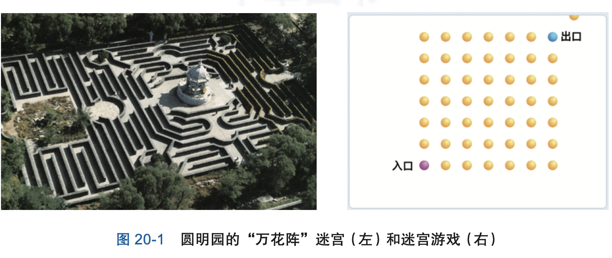
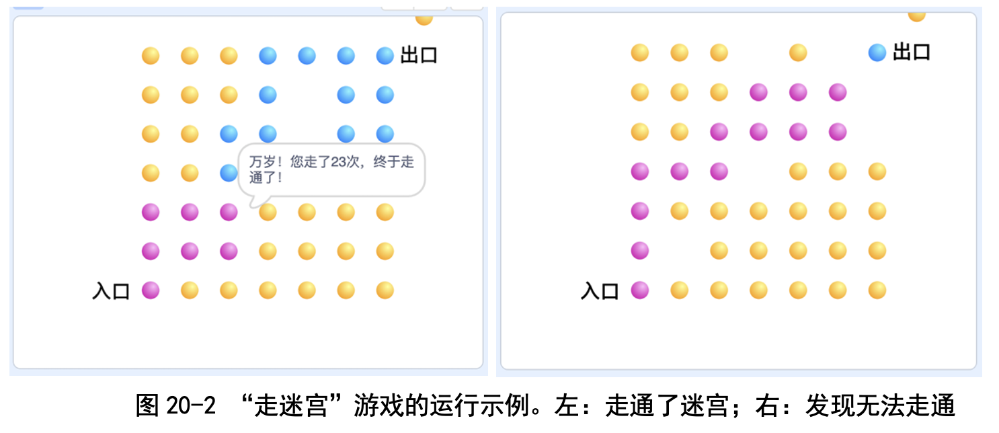
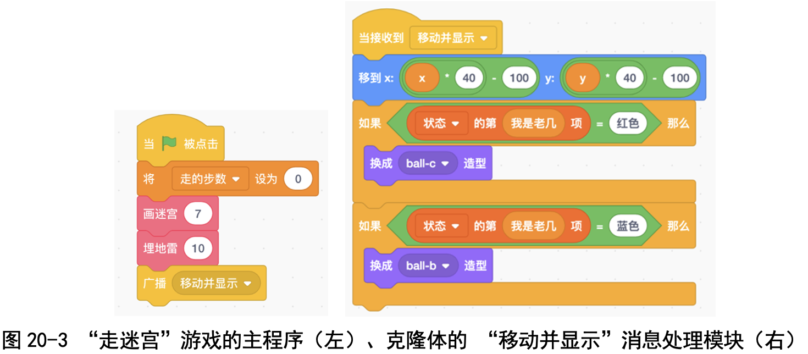
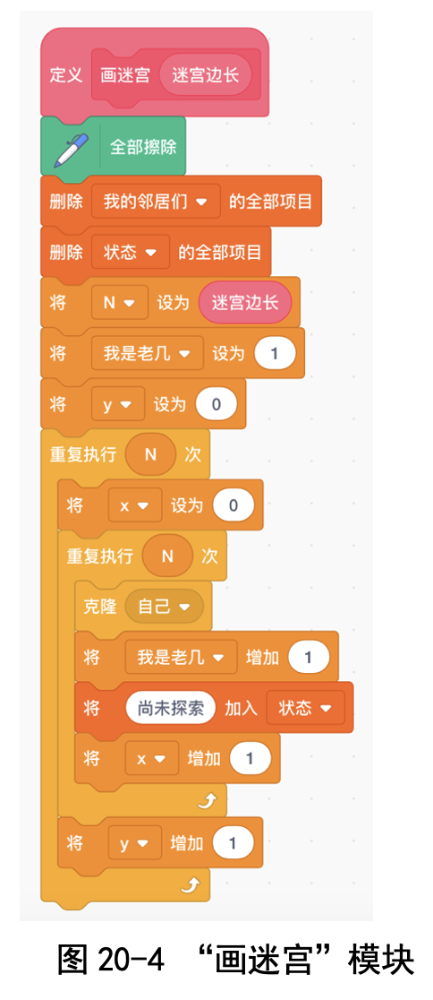
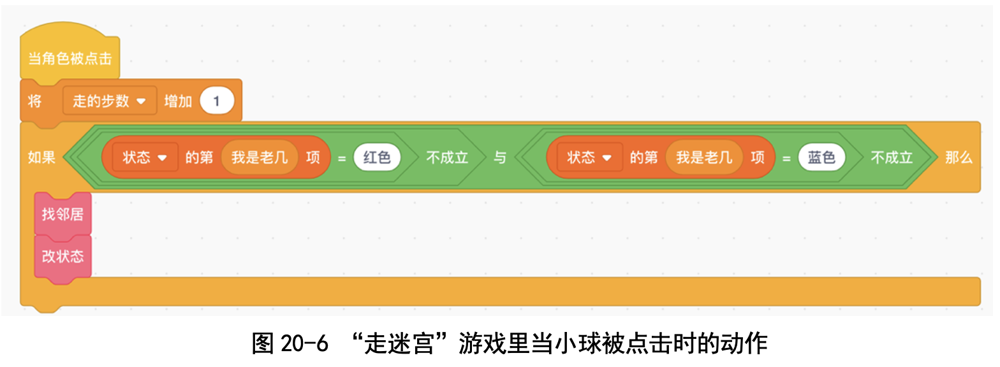
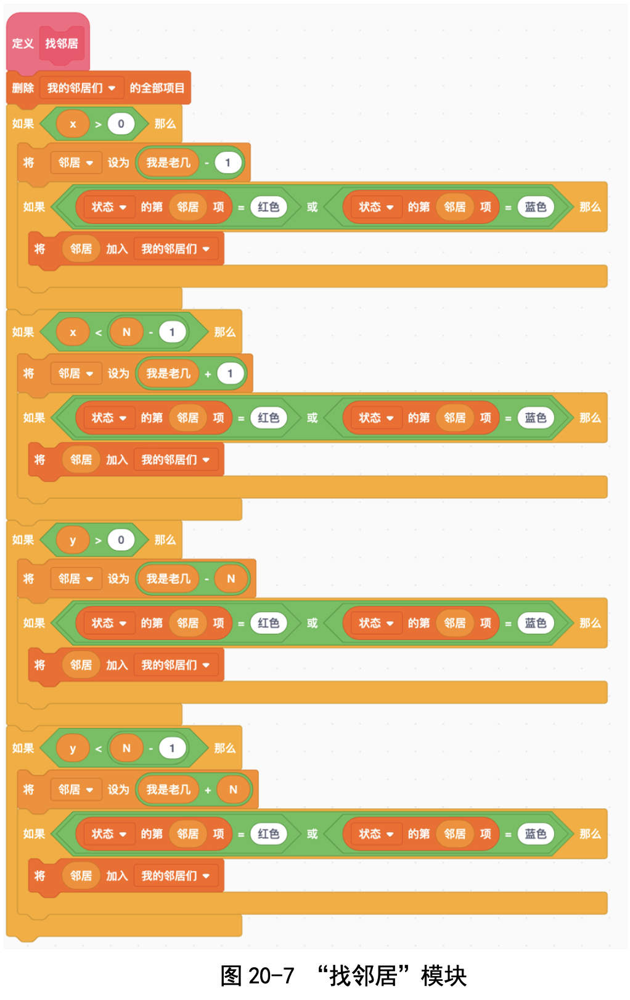

# 第 20 讲 玩游戏体会“搜索法”:走迷宫

## 一、实验目的

卜老师教我们解数学题的时候一再强调:**解题就是搜索，就是找路，找出 一条从“已知条件”到“待求的目标”的路。**

找路就得从当前已推出的结果选择一个方向走走试试，要探索，要尝试; 走得通就走，走不通就退回来重新选择一个方向继续尝试。关键是要积极尝 试，还要善于尝试，也就是选择好尝试的方向。

这跟我们走迷宫非常像，圆明园里有一个用一人高的砖墙建造的迷宫“万 花阵”(见图 20-1 中左侧部分)，迷宫里的道路上有很多分叉口，还有些路是死 胡同。从入口进去之后，想要到达出口可不容易。我是在不知所措的时候，让 爸爸把我举起来看路才走出来的。

为了加深我们对解题策略的理解，卜老师设计了一个“走迷宫”的小游戏: 我们用 7 行 7 列的小球表示迷宫，有入口，有出口，中间有些地方埋有地雷， 表示此路不通(见图 20-1 中右侧部分)。当然了，地雷埋在哪里事先是不知道 的，只有踩到了才知道。问:怎样从入口尽快地走到出口?

走这个迷宫的规则是:

● 每次只能从与当前位置相邻的点选择一个。

● 也可以从出口往回试探。

● 有些地方埋有地雷，表示此路不通，得退回去重新选择。

我们来实现这个小游戏吧!

## 二、基本思路
我们总共有 7×7 = 49 个小球，要是为每个小球都创建一个角色的话，那 还得为每个小球都写一段脚本，就太麻烦了!

一个高效的实现方法是应用“克隆”技术:因为所有小球的脚本都是一样 的，所以我们可以建立小球的 49 个克隆体，这样只要写一份脚本就可以了， 方便吧?

我们给小球染上颜色，表示如下意思:

● 红色:表示能够从“入口到达此处”，换句话说，我们已经“找到过从
入口到达这里的一条路”。

● 蓝色:表示能够从“此处到达出口”，换句话说，我们已经“找到过从
出口到达这里的一条路”。

● 黄色:表示还不知道怎样从入口到达这里，也不知道如何从出口到达
这里。 

一开始的时候，左下角入口处的小球克隆体是红色的，右上角出口处的小
球克隆体是蓝色的，其他小球都是黄色的。每当点击一个小球时，这个小球会 收到“角色被点击”的消息，它就做如下检查和判断:

● 如果小球下面埋着地雷，则隐身，表示“此路不通”。

● 如果上下左右的邻居中同时有红色和蓝色，则意味着“找到了一条从入 口到出口的通路”，成功结束。

● 如果邻居中有红色的，则从这个邻居可以到达小球所在位置，因为从入 口可以到达这个邻居(邻居是红色的)，所以可以从入口经过这个邻居 到达这个小球处，我们就把这个小球也设置成“红色”。

● 如果邻居中有蓝色的，则从这个邻居可以到达小球所在位置，因为从出 口可以到达这个邻居(邻居是蓝色的)，所以可以从出口经过这个邻居 到达这个小球处，我们就把这个小球也设置成“蓝色”。

● 如果邻居中既没有红色的，也没有蓝色的，则表示我们还不知道怎样从 入口到达这里，也不知道如何从出口到达这里，小球保持原有的黄色。

### 代码下载

[走迷宫的代码](Code/第20讲-走迷宫.sb3) 

## 五、实验结果及分析

这个游戏很好玩:走的时候战战兢兢，不知道脚下是否有地雷，还有就是 发现走不通之后，得琢磨退回哪个点再重新开始(见图 20-2)。

我往往是从入口开始试，再从出口倒着走试试，有时能够成功走通!在我 看来，大家刚开始玩的时候，要把地雷的数量设少一点，要不然经常会出现无 路可走的情况哦!

## 六、思考与延伸
### (一)采用什么样的策略走最合适?

我觉得从入口走的时候“一上一右”尝试最合适，从出口倒着走的时候 “一下一左”尝试最合适。这样做的好处是不会太偏离目标。

### (二)“走迷宫”和解数学题之间有什么关系?

在解数学题时，已知条件是入口，求解目标是出口;每次求解就是从入 口向前试探着走一步，或者从出口往回走一步。如果走通了，就表示求解成 功了。

我们学数学的时候，尝试过好几次这种解题策略，很有效果，解题的时候 不会毫无头绪了，也不会在纸上写得丢三落四，漏掉重要的中间结果了。

好了，最后祝大家玩得愉快!

## 七、教师点评

“走迷宫”游戏能够很好地锻炼孩子们的思维方式:在只知道整体目标的 情况下，当前碰到分叉口怎么选择?如果走着走着走到死胡同了，该退回到哪 里重新走呢?

很多事情本质上就是“走迷宫”。比如解数学题，已知条件就是迷宫入口， 要证明或求解的目标是迷宫出口，每一步都可沿着多个方向尝试推导，每一个 方向就是一个分叉，推着推着，推不下去了，或者偏离目标太远了，就得赶紧 想着退回到哪里再继续尝试。哪条路能够走通，哪条路有坑，是无法预知的。

陶哲轩写过一本小册子《跟陶哲轩学解题》，说分享了他的解题方法:拿 一张大纸，顶上写已知条件，底下写待求解的目标，然后从已知条件向下推 理，推出的中间结论都先记录下来，直到能够推导出目标。当然了，不仅可以从已知条件向下推理，还可以从目标倒推，就是明确“要证明目标成立，需要 有哪些条件”，只要最后找到一条“从已知到目标”的路就成功了。

除了解数学题之外，科学研究的过程也是“走迷宫”，也是不断地尝试、 摸索、回溯，时刻衡量当前距离整体目标还有多远、是否偏离目标，有时甚至 连整体目标都不能事先定义清楚，是一种朦胧的状态。

我们设计这个游戏的初衷，就是希望孩子们在玩这个游戏的过程中体会到 搜索、回溯，选择尝试的策略，判断是否偏离目标，并在将来解数学题、做研 究时能够自然而然地应用起来。

至于这个游戏的程序设计部分，用到了克隆、私有变量的定义、列表等， 是对孩子们编程能力的综合检验。
 

[返回上级](index.md)
