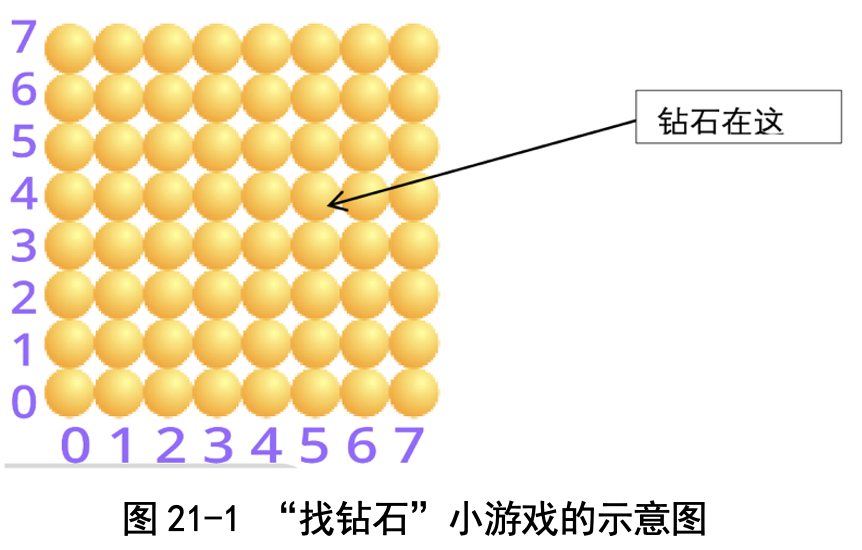
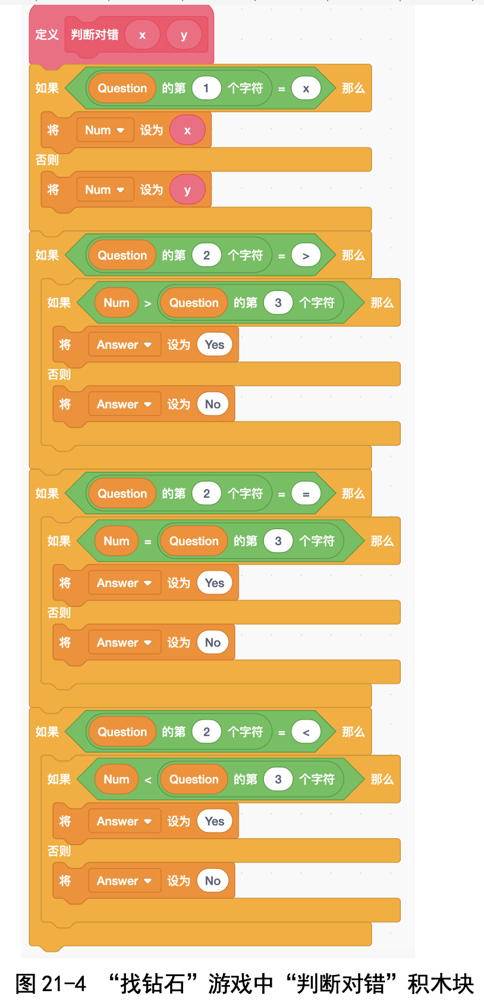
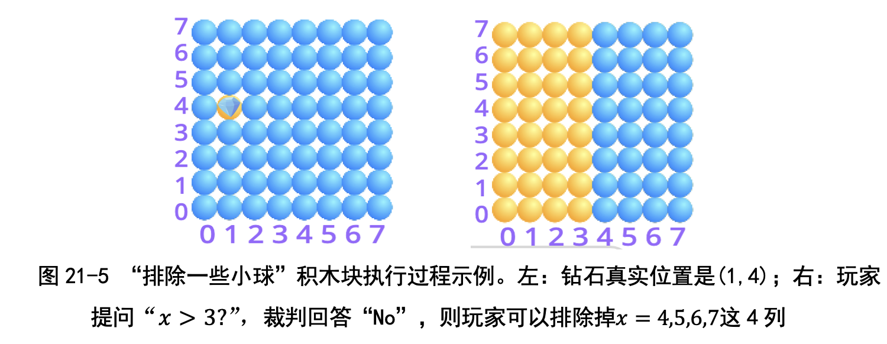

# 第 21 讲 玩游戏体会“二分法”:找钻石

## 一、实验目的

我们喜欢玩“数字炸弹”游戏。这个游戏是两个人(比方说小明和小红) 玩，规则是这样的:

小明想好一个 1~100 之间的数 x，但不把 x 说出来，让小红猜;小红可以 向小明提“Yes/No 型”的问题，小明诚实地回答 Yes 或者 No。考验小红的是: 如何用尽量少的提问，就把这个数 x 猜出来。举个例子，小明想好了数 x = 27。

● 	小红问：x>50？ 小明答：No。

● 	小红问：x>25？ 小明答：Yes。

● 	小红问：x<38？ 小明答：Yes。

● 	小红问：x>32？ 小明答：No。

● 	小红问：x>28？ 小明答：No。

● 	小红问：x=27？ 小明答：Yes！

小红用了 6 次提问，才猜出来小明想的这个数 x=27。 

那小红选择哪些数提问，能够最快地找到答案呢?卜老师说最好的提问方
式是进行“二分法”提问，这样提问的好处是，无论答案是 Yes 还是 No，都 能够把候选数的范围缩小至少二分之一。这样的话，很快就能把范围缩小到只 有一个数，就是答案了!

为了帮助我们理解二分法，卜老师设计了一个“找钻石”的小游戏:我们 有 8 行 8 列共 64 个小球，其中一个小球下面有一颗钻石，钻石的位置(x, y) 只有裁判员知道，我们不知道(见图 21-1)。

我们可以问两种类型的问题:

● 问钻石的 x 坐标:比如 x>3、x<5、x=2 ?

● 问钻石的 y 坐标:比如 y=5、y<3、y>4 ?

裁判诚实地回答 Yes 或者 No。我们的目的是问尽量少的问题来找到
钻石。 

我们一起写程序吧!

## 二、背景知识

为了认识二分法的好处，我们先来看最简单的问法，也就是“逐个枚举” 了:先问x=0?x=1?..., x=7?再问y=0? y=1?..., y=7?这样最多问16个问 题肯定能找到钻石。不过这个方法问的问题有点太多了。我们可以用一个聪明 的方法，就是“二分法”。

二分法的优势在于每次可以消除一半的可能性。比如先问 x>3 ?

● 如果裁判回答 Yes，那么我们就可以不再考虑 x=0, 1, 2, 3 这些位置，这
样 x 的候选范围就只剩下一半的数量了。

● 如果裁判回答 No，那么我们就可以把 x = 4, 5, 6, 7 这些位置去掉，这样
x 的候选范围也是只剩下一半的数量了。 

每次都这样用二分法去做，每次把候选范围缩小一半，只用很少的提问就
可以了。

## 三、基本思路

玩家在输入提问之后，裁判员将不满足条件的小球改变颜色，然后游戏者 继续输入提问，裁判员再将不满足条件的小球改变颜色。如此重复，直到找到 钻石为止。

### 代码下载

[找钻石游戏的代码（发送消息版）](Code/第21讲-找钻石-发送消息版.sb3) 

[找钻石游戏的代码（简洁版）](Code/第21讲-找钻石-简洁版.sb3) 

## 六、实验结果及分析

我玩第一局时，用了 9 次提问(见图 21-7)。玩第二局时，只用了 5 次提 问就可以了。第二次比第一次快，是因为第二次用了二分法，而第一次没有用 二分法。

## 七、思考与延伸

### (一)采用什么样的策略最合适?

采用二分法最好，因为每次都可以排除至少一半的小球。

### (二)傅鼎荃说对 8 行 8 列的游戏来说，使用二分法最多 需要 6 次，为什么?

因为用二分法可以排除一半所以就是 64÷2÷2...，不断除以 2，直到得到 1。我发现有 6 个除号就能把 64 变成 1，所以最多只需要 6 次啦!

刚才我们是从除法的角度计算，如果从乘法的角度来看，我们问的实际上 是“2的几次方等于64”，用对数表示就是log2 64=?什么叫对数呢?比如2的3 次方等于 8，我们就说 8 的对数是 3 ;2 的 6 次方等于 64，我们就说 64 的对 数是 6。

### (三)用递归的观点想一想

我是这样理解递归的:在两面相对的镜子之间放一根正在燃烧的蜡烛，我 们会从其中一面镜子里看到一根蜡烛，蜡烛后面又有一面镜子，镜子里面又 有一根蜡烛......这就是递归。在这一讲中，64÷2÷2...中的不断除以 2 也是 递归。

## 八、教师点评
“数字炸弹”是一个很好的游戏，孩子们在玩这个游戏时，能够自然而然 地领会到“二分法”。二分法的好处是:无论猜对还是猜错，都至少能够排除 掉 1/2 的选项。

这个游戏的另一个用意就是引导孩子们领会“猜测 - 修正”解题策略。在 解决问题时，我们一定要勇敢地去尝试、去猜测，猜错了不要紧，想办法修正 就是了。

[返回上级](index.md)
