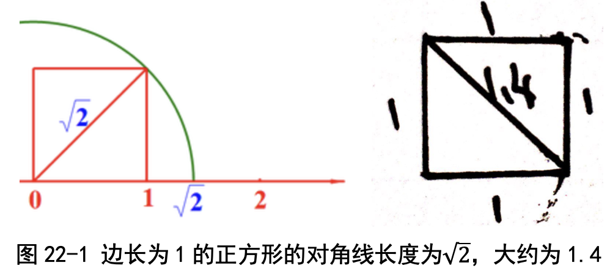
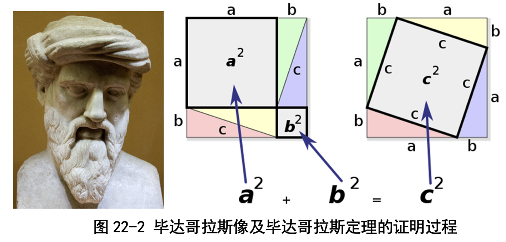
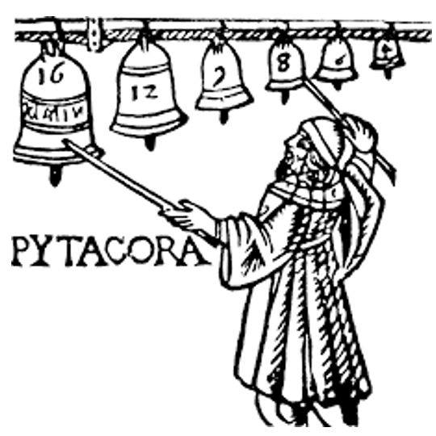
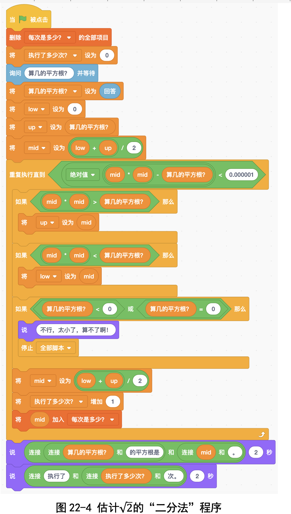
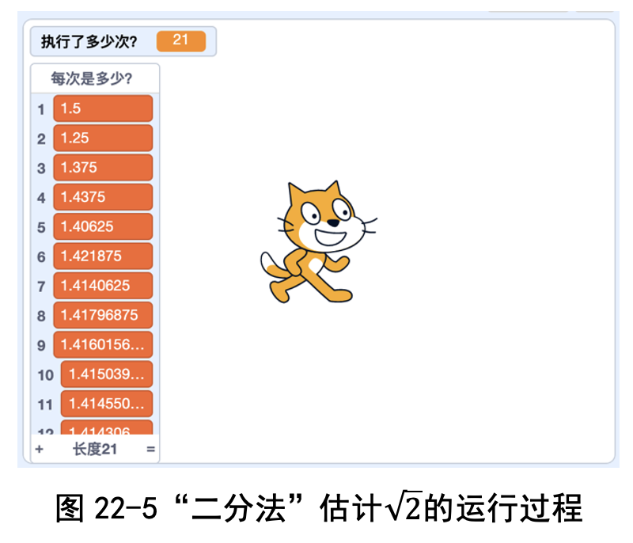
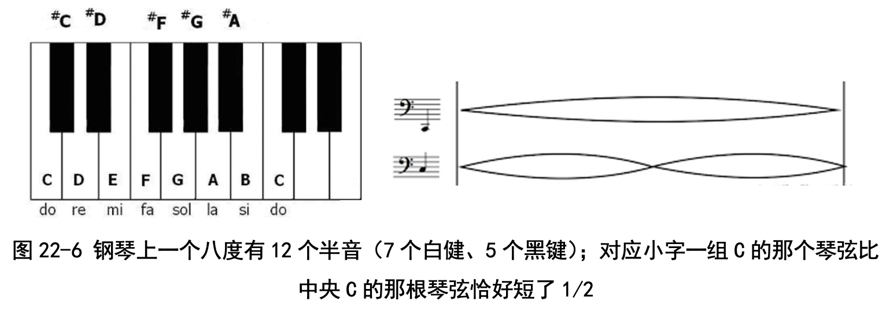
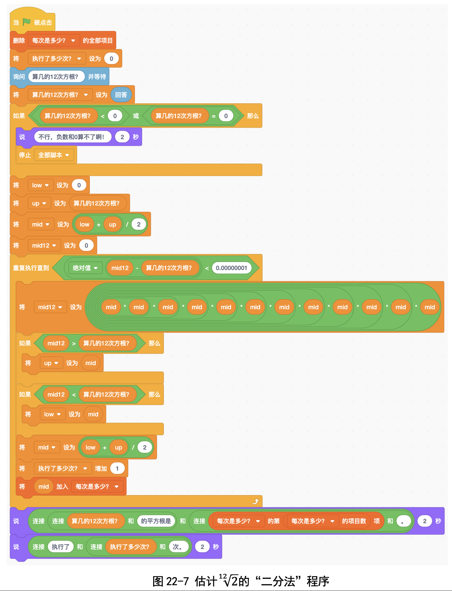
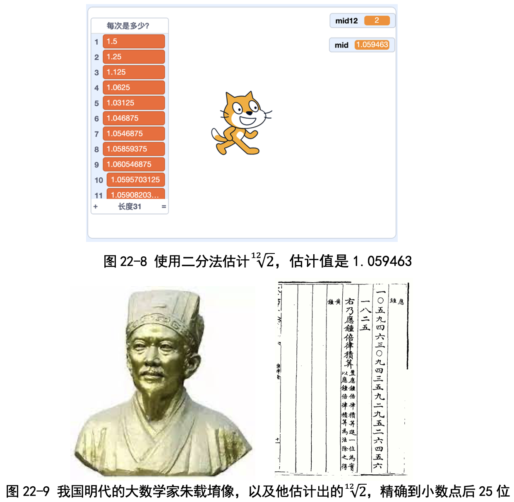

# 第 22 讲 “二分法”的应用:估计√2的值

## 一、实验目的

学完勾股定理之后，我们大家都知道对于边长为 1 的正方形来说，对角线的长度是根号2 。这里根号2是指这样一个数:它自己乘以自己，乘积是 2。 那√2到底是多少呢?我用圆规转一下，发现 √2会落在 1 和 2 之间(见
图 22-1)，也就是比 1 大、比 2 小。我又画了一个边长为 1cm 的正方形，用尺 子量一下对角线，估计长度是 1.4cm，也就是说， √2大约等于 1.4。

那么能不能想个办法，把√2估计得更准确一些呢?我们只学过加减乘除， 开平方没学过啊，那√2可怎么算?

不要担心，平方根这种“逆向”运算我们不 会，可是“正向”的平方我们会算啊。我们可以先猜测根号2的一个估计值，然后进 行正向运算，看看估计值的平方是比 2 大还是比 2 小呢?如果估计值大就减少 一点，小就增大一点。这样不断调整估计值，很快就估计得越来越接近根号2了。

来，我们一起写一个程序估计一下√2吧。

## 二、背景知识
### (一) √2是怎么发现的?
毕达哥拉斯(Pythacoras of Samos，公元前 570 年— 前 495 年)的一位
学生叫希帕索斯，他发现边长为 1 的正方形其对角线长度不是整数，也不能用 分数表示，所以只能创造出一个新的数来表示，这个数就是√2。

### (二)毕达哥拉斯是谁?
毕达哥拉斯是一名古希腊哲学家、数学家和音乐理论家，和我国的孔子是 同时代的人。和孔子一样，毕达哥拉斯也收了很多学生，形成了一个学派，这 个学派证明了毕达哥拉斯定理:直角三角形两直角边长度的平方之和等于斜边 长度的平方，也就是中国古代的“勾股定理”。毕达哥拉斯是用了 4 个直角三角形，摆成两种正方形来证明的(见图 22-2)。

据说证明了这个定理之后，毕达哥拉斯非常高兴，杀了 100 头牛庆祝，所 以这个定理又称为“百牛定理”。

### (三)为什么说√2的发现是一件重要的事情?

毕达哥拉斯学派信奉“万物皆数”，就是世上万 物都能用“整数或整数之比”来表示。

为什么毕达哥拉斯认为整数及整数之比那么重 要呢?有一个小故事能够说明:相传毕达哥拉斯路 过铁匠铺，觉得打铁时大锤和小锤的敲击声特别和 谐，原来大锤小锤的重量之比恰好是特定整数之比， 像左边这幅图一样。
  
  希帕索斯发现√2既不是整数也不是整数之比， 破坏了“万物皆数”这个信条，相传被毕达哥拉斯学派的人投入海中。

事实上， 根号2是一个无理数，就是不能表示成“整数之比”的数(我们在 讲 π 的时候讲过无理数的定义)，是无限不循环的: √2=1.414213562...

## 三、基本思路

刚刚我们用圆规把对角线转过来，发现对角线长度(也就是根号2)比 1 大， 比 2 小。包老师教我们把这个范围用中括号来表示，写成 [1, 2]。

那能不能把这个范围缩小一点呢? 我们用上一讲学过的“二分法”缩小范围:1 和 2 之间的中点是 1.5，我
们先猜测√2=1.5。那这个猜测对不对呢? 

包老师引导我们“反过来想”:“开根号我们不会，但是我们会平方啊。”
我们算一下 1.5 的平方:1.5×1.5 = 2.25，比 2 大，因此 1.5 肯定也比√2大。 因此， √2肯定在 [1,1.5] 这个范围之内。

你看，我们把根号2的可能范围缩小了一半了吧?我们这样不断重复，就能
把范围缩得越来越小，足够小之后就能精确估计出√2了。

### 代码下载及Web版

点击[算平方根的代码](Code/第22讲-算平方根.sb3)下载于本地运行，或点击[算平方根Web版](https://scratch.mit.edu/projects/683362067/)直接运行

点击[算2的十二次方根的代码](Code/第22讲-算2的十二次方根.sb3)下载于本地运行，或点击[算2的十二次方根Web版](https://scratch.mit.edu/projects/683362605/)直接运行

## 六、实验结果

图 22-5 所示是程序的执行结果。我们能够看到一开始估计 √2=1.5，很 不准;第二次估计是 1.25，也不准;不过不要紧，再继续做，接下来是 1.375,
1.437, 1.406, 1.421，到第 10 次的时候，就估计出 √2=1.415，很接近 1.414 了。

 ### (一)除了 2，计算一下其他数的平方根，比如 3、5、7
 
 ### (二)输入不同的初始估计值 low 和 up，需要多少次循 环才能估计准?
 
 这些内容请参见书中第22讲。

## 七、思考与延伸
### (一)有没有更快的方法来估计出√2呢?

刚才我们每次都是取中间数 mid = (low + up)/2。难道一定要取中间点 吗?包老师说取这个范围中的任何一个数都可以，比如我们取得偏一点儿，用 黄金分割点:一开始的时候，我们估计在 [1, 2] 这个范围，也就是说 low = 1，up=2，下一次的估计值不取 1.5，而是取黄金分割点 1.618。

因为 1.618 的平方是 1.618×1.618 = 2.618，比 2 大，也就是说 1.618 肯定
比 √2大，所以我们可以断定 √2肯定在 [1, 1.618] 这个范围之内。这样就把范 围从 [1, 2] 缩小到 [1, 1.618]，范围的大小变成了原来的 0.618。
我们发现:在上界比较大的时候，二分法比黄金分割法更快;在上界比较 小的时候，黄金分割法比二分法更快(见表 22-3)。

###  (二)计算 2 的十二次方根

咦？什么是2的十二次方根？其实类比一下，很好明白：2的平方根√2是这样一个数，它的平方（就是自己乘以自己）等于2。那2的十二次方根就是这样一个数，它的12次方（就是自己乘以自己，连乘12次）等于2。

2的十二次方根是啥我懂了，可是为啥要算它呢？

这背后有很好玩儿的故事。同学们大多数学过至少一件乐器的演奏，比如钢琴、小提琴等等。在学基础乐理的时候，音乐老师说过“八度”这个概念，就是钢琴上小字一组的C比中央C要高一个八度。那高一个八度到底是啥意思呢？我们打开钢琴的后盖就明白了，原来啊，对应小字一组C的那个琴弦比中央C的那根琴弦恰好短了1/2，反过来说，中央C的那根琴弦长度是小字一组C的2倍（图22-6）。

老师还教过我们一个概念，叫作“半音”：一个八度有12个半音；或者换句话说，从中央C到小字一组的C，有12个键（包括7个白键、5个黑键），相邻的键之间差1个半音。

那问题来了：中央C的那根琴弦长度是小字一组C的2倍；中央C到小字一组C之间有12个键（就是12根琴弦），那相邻的琴弦之间长度之比是多少呢？

对啦！如果我们把相邻琴弦之间的长度之比设计成2的十二次方根的话，连乘12次，就得到2，那中央C的那根琴弦长度就正好是小字一组C的2倍啦。这种分法，能够分得非常均匀，叫作十二平均律；钢琴就是根据十二平均律定音的。

最后一个问题是：2的十二次方根到底是多少呢？是1.1？还是1.01？我们写个程序算一算吧！

我们已经学会了写程序算2的平方根等于多少，关键点是“反过来想”：平方根不会算，咱们就反过来想，算估计值的平方。我们先估计一个值，比如1.5，然后算它的平方1.5×1.5=2.25，比2大，说明我们估计得太高了，需要再调低一点儿。

这里也一样，我们不会算2的十二次方根2的十二次方根，就反过来想，算估计值的12次方，然后跟2比大小，大的话就调低一点儿估计值，小的话就增加一点儿估计值。我们写的程序是这样的（图22-7）。
 

我们的程序估计出2的十二次方根=1.059463，精确到小数点后9位，非常准（图22-8）。

不过查了资料才知道，我国明朝时有位大数学家朱载堉，用算盘就算出来2的十二次方根=1.059463094359295264561825，达到了小数点后25位。太牛了！

卜老师告诉我们说：北大物理系武际可教授进行了考证，认为朱载堉算出来的2的十二次方根估计值通过传教士利玛窦传到了西方，促进了西方从羽管琴到现代钢琴的演变（要是不知道这个数的话，钢琴的琴弦该截多长呢？）；物理学家亥姆霍兹也给予朱载堉极高的评价和赞誉（图22-9）。

## 八、教师点评

√2是历史上发现的第一个无理数。孩子们自己算出而不是简单背诵√2=1.414，有助于理解这个无理数。

开根号怎么算？孩子们一开始是手足无措的：只学过加减乘除，不知道怎样用加减乘除得到平方根。

这堂课最重要的东西就是“反过来想”：算平方根不会算，就转化成会算的平方。我们先估计一个值，比如1.5，然后算估计值1.5的平方：1.5×1.5=2.25，比2大，那1.5肯定也比√2大；我们就把估计值1.5调低一点儿，√2肯定在[1,1.5]这个范围之内。

一开始范围比较大，那不要紧；上堂课我们学过了“试错法”，就是不断地猜测、验证、修正，逐渐把范围缩小。

这种“反过来想”的思考方式，是我们希望孩子们能够记在心里的东西。

计算2的十二次方根背后的历史也值得一提：朱载堉没有电子计算器，只能用简陋的算盘，还是自制的“八十一档”大算盘；没有方便的阿拉伯数字“1, 2, 3, 4, 5, 6, 7, 8 , 9, 0”，只能有用汉字“一、二、三、四、五、六、七、八、九、〇”，却能完成这么精确的计算；其毅力之大、方法之妙，着实让人钦佩。
 

[返回上级](index.md)
