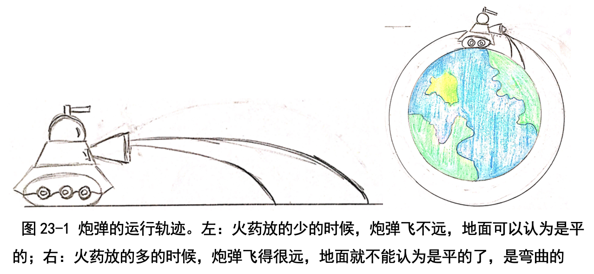
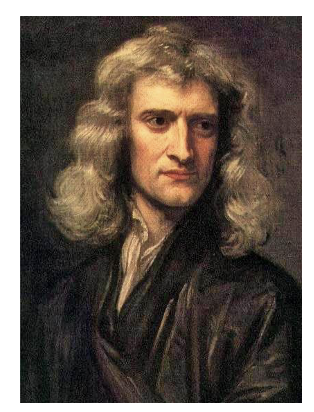
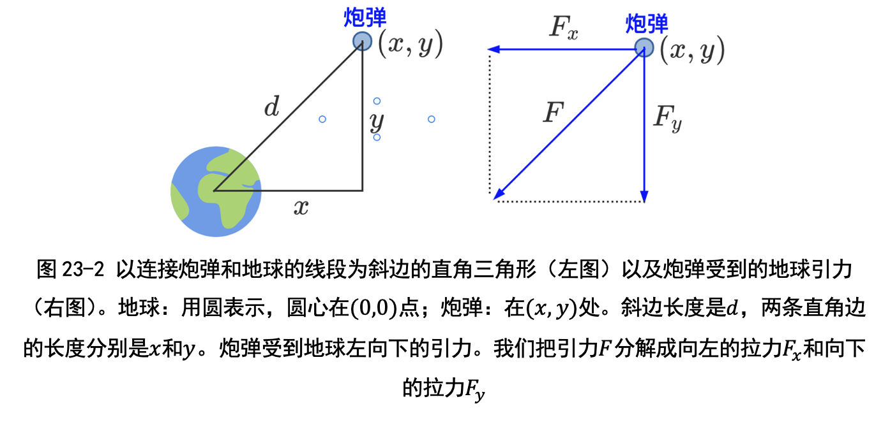
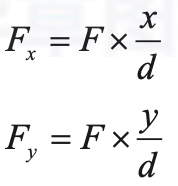
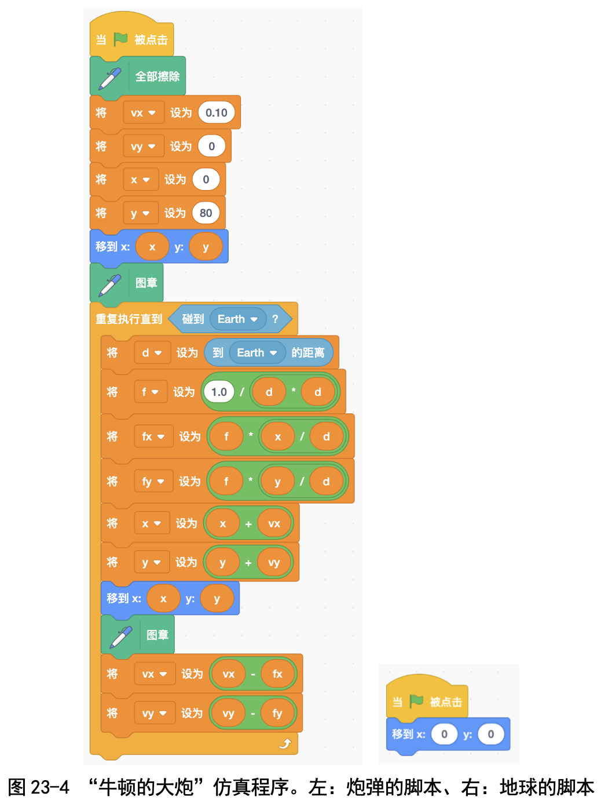
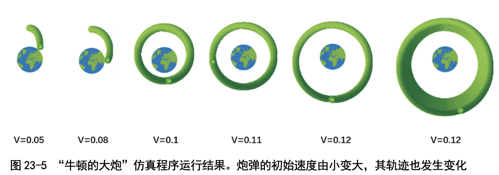
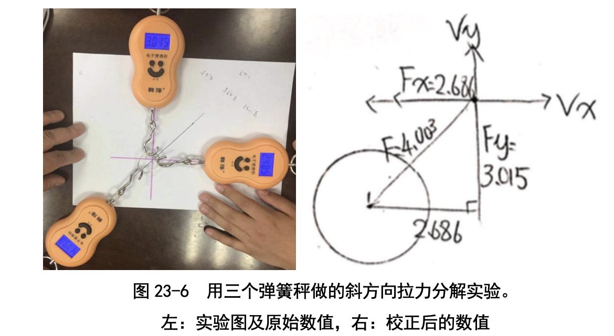

# 第 23 讲 仿真世界:牛顿的大炮

## 一、实验目的

牛顿在他的一本书里提出过一个有趣的问题:把一门大炮搬到山顶上，水 平发射炮弹，那炮弹会怎样飞呢?

如果没有地球对炮弹的引力的话，炮弹会一直水平飞。当然我们知道这是错 的:地球对炮弹有引力，会拉着炮弹向下拐弯，一会儿就落地了(见图 23-1)。 不过牛顿想得更多一点:要是炮弹里的火药装多一些，炮弹飞得再快一点，
那会怎样呢?我也不知道，咱们一起编程模拟一下吧!

## 二、背景知识

### (一)牛顿是谁?

第一次听到牛顿的名字，我还以为他姓牛呢!后来才知道他不姓牛，而是姓牛顿，名字叫艾萨克，全名是艾萨克·牛顿(Issac Newton)。 关于牛顿有很多传说:比如被苹果砸到脑袋，发现了万有引力定律(卜老师告诉我们此事真假存疑，部分来源于伏尔泰的转述);还有就是牛顿用三棱 镜把一束白光分解成多种颜色的光，再用一个三棱镜又混成了白光。

牛顿真是牛啊!

### (二)牛顿的大炮是用来做什么的?
牛顿想用“山顶上开炮”实验说明“炮弹飞快了就是一颗小行星”，以此 来说明他的引力理论既适用于炮弹，也适用于行星，是个“万有引力”理论。 

按照通常的想法，水平开炮，炮弹被地球吸引，会拐弯，一会儿就会落
地;不过牛顿想得更多:多装火药，炮弹就飞得远一点才落地。 要是再多装一些火药呢?一个关键的问题出现了:大地可不是平的，而是 向下弯曲的;地球地球，地面可是一个弯曲的球面啊。那么炮弹往下拐弯的同 时，大地也往下弯曲，那炮弹可能永远都不会碰到地面(见图 23-1)。岂不是
炮弹就成了一颗环绕地球一直飞的卫星呢? 

这就是牛顿当时的想法。不过具体装多少火药，也就是炮弹的速度是多少
才能变成卫星(第一宇宙速度，即 7.9 km/s)，咱们写程序模拟一下看。

## 三、基本思路

如何模拟炮弹的轨迹呢?

炮弹一开始发出来是沿着水平方向走的，但沿着水平方向走的只是刚发出 来的那一刻，下一刻就会向下坠一点点。这是很细微的变化，我们看不见，不 过用不了几秒，就会发现炮弹已经拐弯向下走了。

地球对炮弹的引力会改变炮弹的速度。这很好理解:我骑自行车的时候， 同学拉着自行车，我的速度就变慢了，要是向前拉，我就骑得越来越快。

引力一开始改变炮弹垂直方向的速度，垂直方向的速度改变炮弹的 y 坐标;引力也会改变炮弹水平方向的速度，水平方向的速度改变炮弹的 x 坐标。 概括一下:“引力改速度，速度改位置。”

### 变量设计

(1)位置:我们用 (x, y) 表示炮弹的位置;用 d 表示炮弹到地球的距离(见 图 23-2 左图)

(2)引力:用 F 表示地球对炮弹的引力(也叫万有引力);用 Fx 和 Fy 分别 表示水平方向的力和垂直方向的力(见图 23-2 右图)。

(3)速度:我们用 Vx 和 Vy 分别表示炮弹水平方向和垂直方向的速度(见 图 23-3)

那引力有多大呢?牛顿的万有引力定律说“距离越大，引力越小;引力和距离的平方成反比”，也就是说 F = 1/(dxd) 。(卜老师说这个公式是简化后的公式:引力和地球、炮弹的质量有关;这里地球和炮弹的质量一直不变，我们就省略了。)不过炮弹受到的拉力 F 是斜着的，那水平方向拉力 Fx 和垂直方向拉力 Fy 又是多少呢?

为了弄明白这一点，卜老师带着我们用三个弹簧秤做了一个小实验:一 个弹簧秤斜着拉，一个弹簧秤沿着水平方向拉，另一个弹簧秤沿着竖直方向 拉(具体的实验过程见后面的“教师点评”)。实验结果表明:炮弹受到斜方向 的拉力 F 和水平方向的拉力 Fx、垂直方向的拉力 Fy 组成一个直角三角形(见 图 23-3)。按照比例关系，我们这样计算水平方向的拉力 Fx 和垂直方向的拉力 Fy:

### 过程描述
我们总结一下上面的分析:每过一秒，炮弹的位置 (x, y) 都会改变;改变 多少是由水平速度 Vx 和垂直方向速度 Vy 决定的。

● 新的 x = 原来的 x+Vx×1

● 新的 y = 原来的 y+Vy×1

每过一秒，炮弹的速度也会发生改变;改变多少是由受到的引力决定的:

● 新的 Vx = 原来的 Vx+Fx×1

● 新的 Vy = 原来的 Vy + Fy×1

如图 23-4 所示，炮弹的仿真程序就是在不断重复这两个过程:每一秒重
新计算一下水平方向的拉力 Fx 和垂直方向的拉力 Fy，然后用上面的式子计算 新的水平速度 Vx 和垂直方向速度 Vy ，最后再计算新的位置 (x, y)，移动到新位 置之后盖个章就行了。

### 代码下载

[牛顿的大炮仿真程序](Code/第23讲-牛顿的大炮.sb3) 

## 六、实验结果

现在我们运行一下程序，看看随着火药不断增加，速度变大，炮弹轨迹如何变化吧。图 23-5 显示这个仿真程序的运行结果:

1)当炮弹速度等于 0.05 时，轨迹是抛物线，一会儿就落地了。 

2)当炮弹速度等于 0.08 时，轨迹还是抛物线，就是走的距离更远了。 

3)当炮弹速度等于 0.1 时，轨迹是椭圆;炮弹弯，地面也弯，炮弹不落
地，成卫星啦!

4)当炮弹速度等于 0.11 时，轨迹成了圆形，地球是圆心;这是一颗地球
同步卫星。

5)当炮弹速度大于 0.12 时，轨迹又变成了椭圆。不过跟上一次的椭圆不
同，这次地球偏在椭圆的上半部分。

6)我多运行一会儿，结果发现这个椭圆竟然不断往外扩散，很奇怪!卜 老师说这应该是 Scratch 计算的误差;当炮弹发射时，时刻都有引力的作用， 不会向外扩散。

## 七、思考与延伸
其实牛顿并没有拿着大炮去发射，而是在头脑中思考，这样的实验叫“思 想实验”。

如果速度一直增大，大炮有可能冲出地球走向太阳系(必须达到宇宙第 二速度，即 11.2km/s);如果再增大将冲出太阳系走向银河系(宇宙第三速度， 即 16.7km/s);如果再增大将会冲出银河系，炮弹不知道绕着哪个星系转了。 炮弹在宇宙中乱撞，可就出大事了!如果我们能掌握好发射的力量和角度，它 就不会在宇宙中乱撞了，会飞到我们指定的行星去做卫星。

不过引力到底是怎样形成的呢?要是能够设计一种地毯，隔绝重力对我的 吸引，我把一路都铺上毯子，就能飞去学校了，那该多好啊!

## 八、教师点评
“牛顿的大炮”是一个思想实验。牛顿自己并没有带着大炮去山顶开炮; 孩子们写程序来仿真，也是一种思想实验。在实验中观察到抛物线先变成椭 圆，再变成圆，最后又变成椭圆，孩子们非常兴奋!

在这个实验里，关键之一是“当引力 F 是斜方向的时候，在水平方向的分 量 Fx 和垂直方向的分量 Fy 分别是多少呢?”为了避免引入“分量”这些概念， 我们带着孩子们用三根弹簧秤做了个补充实验，终于从直观上弄明白了这个 问题!

孩子们对引力非常好奇，也有一些自发的思考;可见好奇心是自发萌生的， 有时都不用诱导。比如卜文远同学，上三年级的时候就问过“引力怎么来的? 能否隔开?为何隔不开?”，甚至还想发明一种“能够隔绝重力的飞行毯”。

这些问题我回答不了，现有的物理学知识还解释不清楚引力的来源。 在这一讲，我们还给孩子们补充了以下的知识点。
### (一)如何根据斜方向的拉力 F 计算出水平方向的拉力 Fx 和竖直方向的拉力 Fy ?

在这个实验里，关键之一是“当引力 F 是斜方向的时候，在水平方向的分 量 Fx 和垂直方向的分量 Fy 分别是多少呢?”为了避免引入“分量”这些概念， 我们带着孩子们用三根弹簧秤做了个补充实验，终于从直观上弄明白了这个 问题!

做这个实验时，我们让三位小朋友各拉一根弹簧秤:一个弹簧秤斜着拉， 模拟地球对炮弹的引力 F ;另外两个弹簧秤分别沿着水平方向和垂直方向拉， 分别模拟 Fx 和 Fy。孩子们使劲儿拉，还得注意保持钩子交叉点稳定在原点、 两个弹簧秤要处于水平和垂直方向。

图 23-6 显示一次实验的结果:斜方向、水平方向和垂直方向的弹簧秤读 数分别是 F=4.190, Fx=2.485, Fy =3.015。不过直接从这些读数上看不出什么规 律，这是因为我们买的弹簧秤精度比较差:两个弹簧秤对头拉，读数竟然不 一样!

我们只好以水平方向的弹簧秤为基准，重新校准了一下另外两个弹簧秤，得 到了新的数值:F=4.003, Fx=2.686, Fy=3.015。卜文远同学画了一幅图(图 23-6 右图)，这回就看出来规律啦!

2.686x2.686 + 3.015x3.015 = 4.003x4.003 ≈ 16.024

用符号表示，就是 

Fx的平方 + Fy的平方 = F的平方

这一下子，孩子们立刻就兴奋了:这就是勾股定理啊，那肯定是直角三角形啊!

当然了，后面还得说明由力 F, Fx, Fy 组成的直角三角形与由距离组成的直
角三角形相似。这超出了孩子们的知识范畴和我们用的弹簧秤的精度，我只能 直接提这个结论，没法给出更好的论据来。

### (二)平方反比率的推导和背后原因

详细内容请参见书中第23讲。

### (三)牛顿和他所在的那个光辉时代

非常需要给孩子们补充的，是一些科学史:牛顿出生于 1643 年;在牛顿 出生的前一年，另一位大物理学家伽利略去世，有点儿牛顿接伽利略的班儿的 意思。伽利略可不简单:他摒弃了亚里士多德的“纯粹思辨”研究方法、倡导
“靠观察和实验”的科学研究方法，因此被称为“现代科学之父”。 

按照日本物理学家朝永振一郎的主张:现代科学的出现，可以开普勒在 1618 年提出天体运行三定律为标志，到现在也只有 400 年多一点。牛顿出生 的第二年，恰好是清兵入关、明朝灭亡。看来现代科学的萌芽，确实是在明末
清初，也只有 400 多年的历史啊! 

### (四)用更大号的三棱镜重做牛顿的光谱实验
牛顿用三棱镜把白光分解成光谱。不过牛顿用的三棱镜小了点，如果用更 大号的三棱镜会出现什么情况呢?物理学家夫琅禾费使用大号的三棱镜，把太 阳光分解成更清晰的光谱，结果观察到彩色光谱中会有一些黑色的暗谱线;后 来发现这些谱线和太阳表层和地球大气层中的元素相关。

希望孩子们长大后学习到量子力学时，能够想起“大号的三棱镜”来。

[返回上级](index.md)
