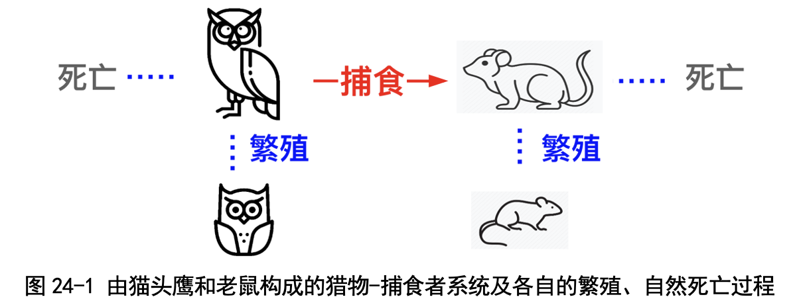
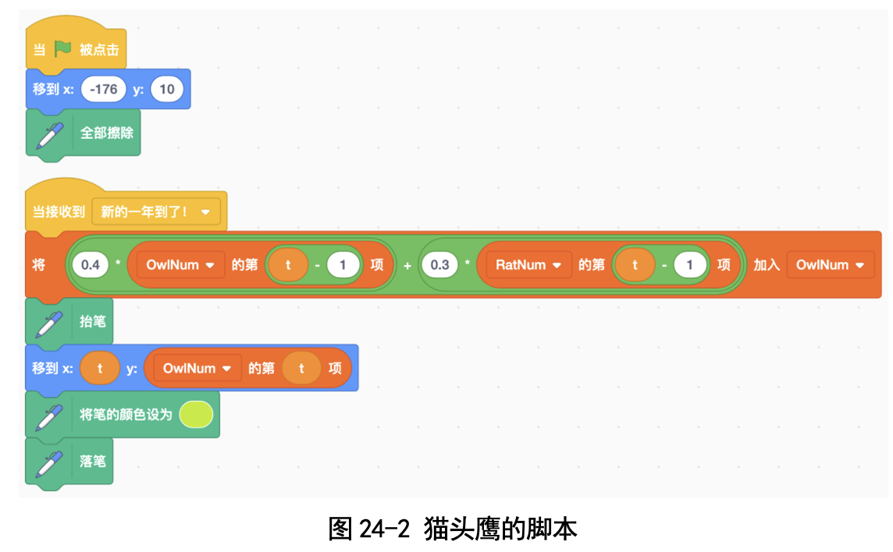
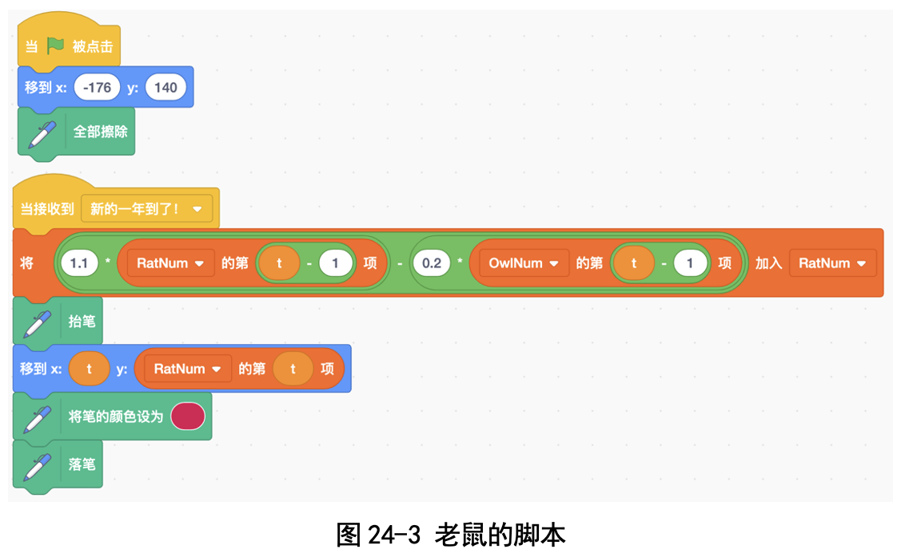
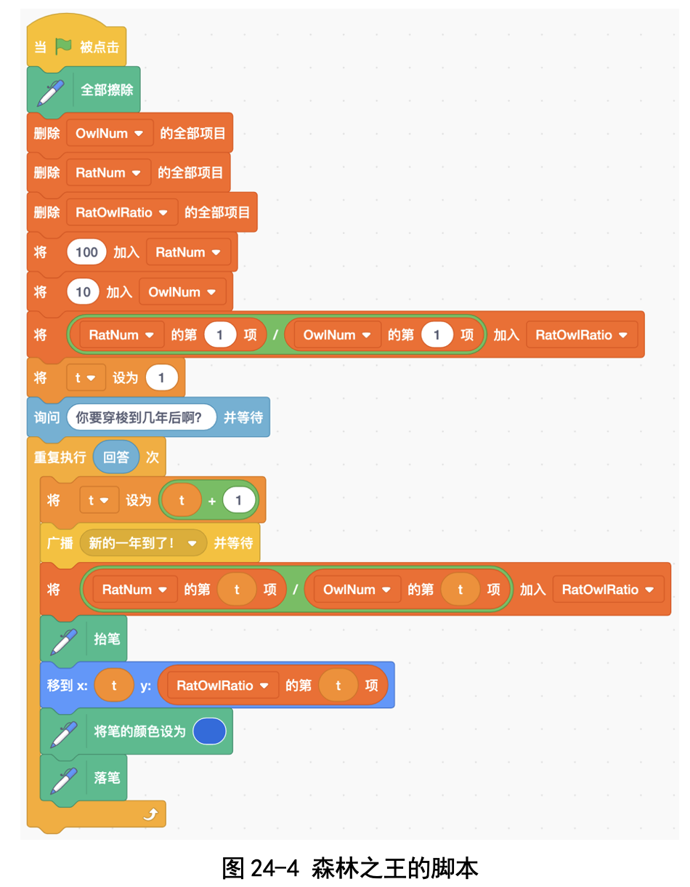
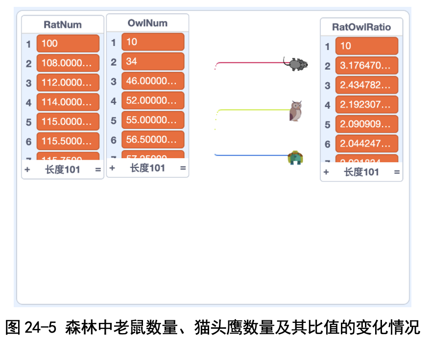
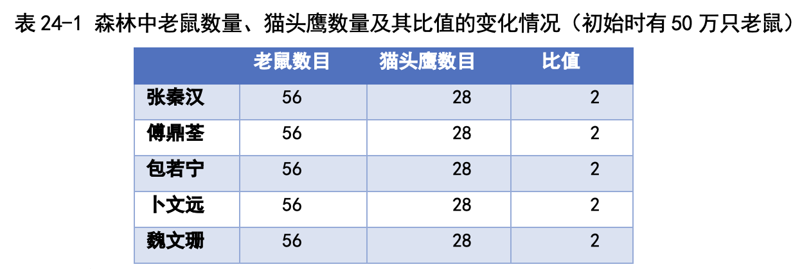
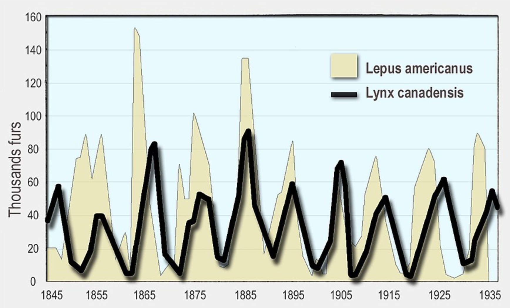

# 第 24 讲 再论仿真世界: 森林里有几只老鼠，几只猫头鹰?

## 一、实验目的

森林里有繁殖能力超强的老鼠，还有专门吃老鼠的猫头鹰。像图 24-1 中 显示的那样，老鼠多了，猫头鹰有了食物，也会变多;猫头鹰一多，吃的老鼠 也多，老鼠反而会变少，猫头鹰缺少食物会被饿死;猫头鹰少了，老鼠又会变 多......哎呀，好复杂!

那森林里到底有几只老鼠，几只猫头鹰呢?想是想不清楚了，我们写个程 序模拟一下，看看老鼠和猫头鹰的数量变化吧!

## 二、背景知识
假设远古时代，黑暗森林纪元元年，森林里有 10 万只猫头鹰，100 万只老鼠。老鼠和猫头鹰的出生率和死亡率如下:

● 老鼠:繁殖能力超强，第 2 年的数量是第 1 年的 1.1 倍，变成了 100×
1.1=110 万只。不过老鼠也有一定的死亡率，因为每 1 万只猫头鹰会吃 掉 0.2 万只老鼠，10 万只猫头鹰会吃掉 10×0.2，即 2 万只老鼠。因此 第 2 年共有 118 万只老鼠。

● 猫头鹰:寿命不长，死亡率超级高，第 2 年的数量是第 1 年的 0.4，就 是变成了 10×0.4=4 万只，但是如果猫头鹰有足够的老鼠当食物的话， 会生小猫头鹰，小猫头鹰数量是老鼠数量的 0.3，就是 100×0.3，即 30 万只，这样第 2 年共有 34 万只猫头鹰。

这样一直进行下去，会发生什么事情呢?猫头鹰多还是老鼠多?包若宁的 猜测是:猫头鹰的死亡率是 60%，森林里应该很快会没有猫头鹰了啊。傅鼎 荃的猜测是:猫头鹰少→老鼠多→猫头鹰多→老鼠少→猫头鹰少，那应该是个

“一年多，一年少”的循环啊? 真是“公说公有理，婆说婆有理”，到底谁说的对呢?我们写个程序当裁
判吧!

## 三、基本思路

我们设置两个列表，分别记录老鼠和猫头鹰历年的数量，然后依据今年的 猫头鹰和老鼠的数量估计明年猫头鹰和老鼠的数量。比如:

(1)第一年:

● 老鼠有 100 万只

● 猫头鹰有 10 万只

(2)第二年:

● 老鼠的数量 =(100×1.1) - (10×0.2) = 110-2 = 108(万只)

● 猫头鹰的数量 =(10×0.4) + (100×0.3) = 34(万只)

(3)第三年:

● 老鼠的数量 =(108×1.1) - (34×0.2) = 118.8 - 6.8 = 112(万只)

● 猫头鹰的数量 = (34×0.4) + (108×0.3) = 46(万只) (4)其他年份的依次类推。

### 角色设计

● Rat:老鼠。

● Owl:猫头鹰。

● Cat:森林之王，统计森林里动物的数量。

### 过程描述

***(1)猫头鹰的脚本*** 

猫头鹰收到森林之王发来的“新的一年到了”消息之后，根据上一年猫头
鹰和老鼠的数量，计算今年会有多少只猫头鹰(见图 24-2)。 

***(2)老鼠的脚本***

老鼠收到“新的一年到了”消息之后，根据上一年猫头鹰和老鼠的数量， 计算今年会有多少只老鼠(见图 24-3)。

***(3)森林之王的脚本***
森林之王一开始设置森林里有 100 万只老鼠和 10 万只猫头鹰，然后广播
“新的一年开始了”消息，等待老鼠和猫头鹰接收到消息之后更新数量，然后 计算两者数量之比，绘图(见图 24-4)。

### 代码下载 

[森林里猫头鹰和老鼠数量仿真的代码](Code/第24讲-猫头鹰和老鼠.sb3) 

## 六、实验结果

从图 24-5 所示的变化曲线，我们可以观察到这样的现象:

● 猫头鹰的数量:猫头鹰的数量从 10 万只开始逐渐增大，从第 10 年就稳
定下来，不再变化了，保持在 58 万只。

● 老鼠的数量:和猫头鹰的数量变化类似，老鼠的数量也是从 100 万只逐
渐增大，到 46 年的时候就已经平稳不变了，保持在 116 万只。

● 猫头鹰和老鼠的数量之比:老鼠数量增长，猫头鹰数量也增长，最后都 稳定下来了。老鼠和猫头鹰的数量之比一开始比较大，是 10，然后迅速
下降，等到第 10 年的时候，就下降到了 2 附近，再之后就基本不变了。 数量和比例都稳定下来了，我想这就是自然界的规律吧。

## 七、思考与延伸
### (一)要是第一年只有 50 万只老鼠呢?

刚才是第一年有 100 万只老鼠、10 万只猫头鹰的情况，最后都稳定了。 要是一开始只有 50 万只老鼠呢?我们几个人各自运行自己的程序，得到的结 果如表 24-1 所示。

我们四个人得到的结果都一样:老鼠数量稳定在 56 万只，猫头鹰数量是 28 万只，比值还是 2，跟第一年 100 万只老鼠的时候一模一样。

### (二)假如 1 万只猫头鹰每年吃掉 0.1 万只老鼠呢?
刚才我们假设 1 万只猫头鹰每年吃掉 0.3 万只老鼠，要是猫头鹰吃得少一 点，每年吃掉 0.1 万只老鼠呢?我们模拟的结果如表 24-2 所示。

我们可以看出，虽然初始的老鼠数量不同，但是最后得到的比值都是一样 的，而且和上面两种情况是差不多的，是 2.18，只差了 0.18.

### (三)假如 1 万只猫头鹰每年吃掉 0.2 万只老鼠呢?

从模拟结果我们可以看出，猫头鹰数目都是 0.1008，老鼠数目也差不多都 是 0.057，比值都是 1.767。

看来猫头鹰的饭量越大，最后老鼠跟猫头鹰数量的比值越小，这个倒是正 常的。不过当猫头鹰的饭量是 0.2 的时候，最终的比例虽然稳定，但是无论是 老鼠还是猫头鹰都很少，快灭绝了(见表 24-3)。

当然，我们还可以改变老鼠、猫头鹰的繁殖速度，看看会发生什么情况; 或许傅鼎荃猜测的“一年大、一年小”的情况会发生呢!

## 八、教师点评
森林里的老鼠和猫头鹰是一个典型的“猎物 - 捕食者”动力学系统。孩子 们目前当然不必知道“动力学”这样高深的名词，只需要知道“从上一年的数 量能够算出下一年的数量”就足够了。

孩子们变换不同的参数，观察到这样的现象:老鼠、猫头鹰的数量之比和 第一年的数量是没有关系的，只跟老鼠、猫头鹰的繁殖率，以及它们之间的捕食有关系。 孩子们做的实验里，老鼠、猫头鹰的数量之比最终都会稳定下来，那会不
会出现傅鼎荃猜想的“一年大、一年小”这种波浪形呢?会的!我们改变老鼠 的繁殖率，是会观察到这种现象的。
一个有名的案例，就是卢卡斯书中写的加拿大山猫 - 雪兔的数量变化，的确是周期性的。

图24-5 加拿大山猫-雪兔数量周期性变换。图片源自 https://upload.wikimedia.org/wikipedia/commons/thumb/5/5b/Milliers_fourrures_vendues_en_environ_90_ans_odum_1953_en.jpg/880px-Milliers_fourrures_vendues_en_environ_90_ans_odum_1953_en.jpg

美国 C. Lay 教授写的名著《线性代数及其应用》里讲到矩阵特征值时， 就是用的老鼠 - 猫头鹰这个捕食系统作为第一个例子。张秦汉小朋友对“猫头 鹰 - 老鼠”这个问题非常感兴趣，一直想弄明白为什么最后会稳定，什么时候 才会“一年大、一年小”。这些问题留给他以后去证明吧。

[返回上级](index.md)
