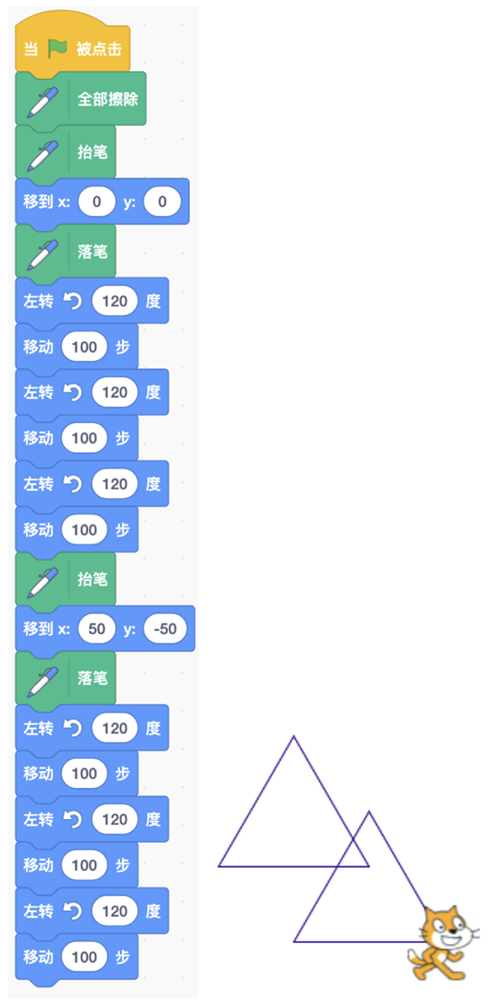
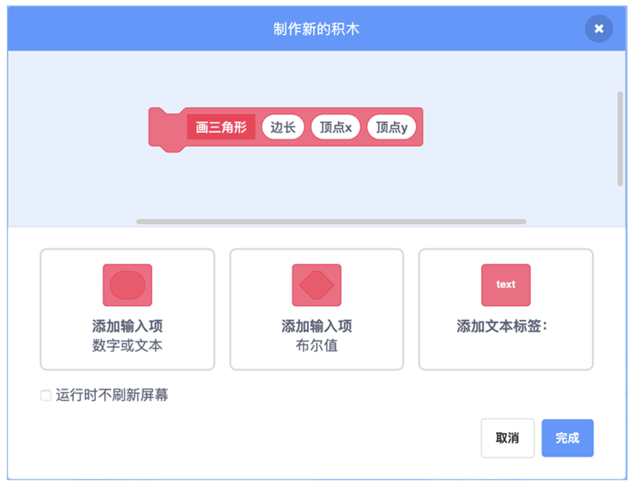
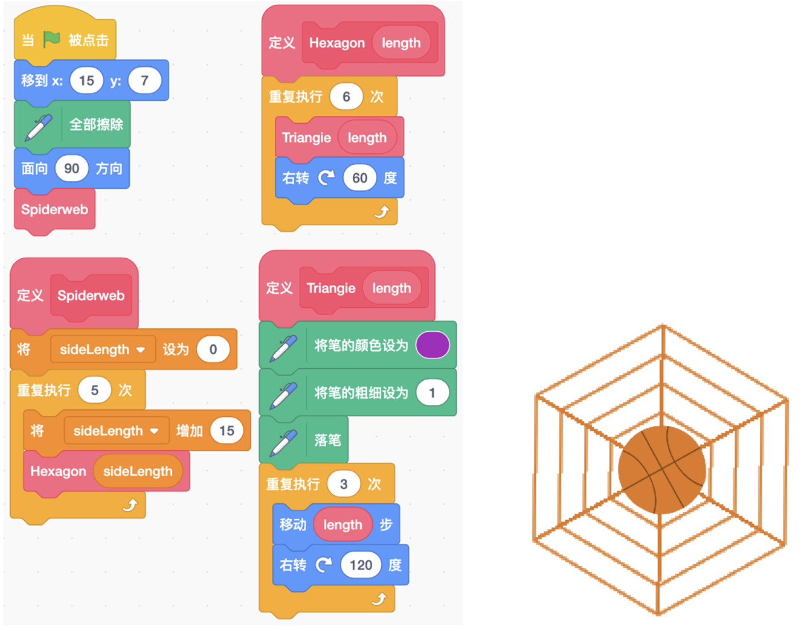
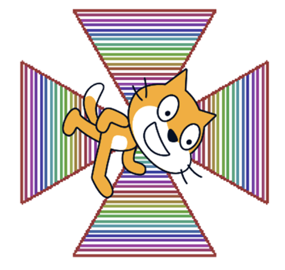
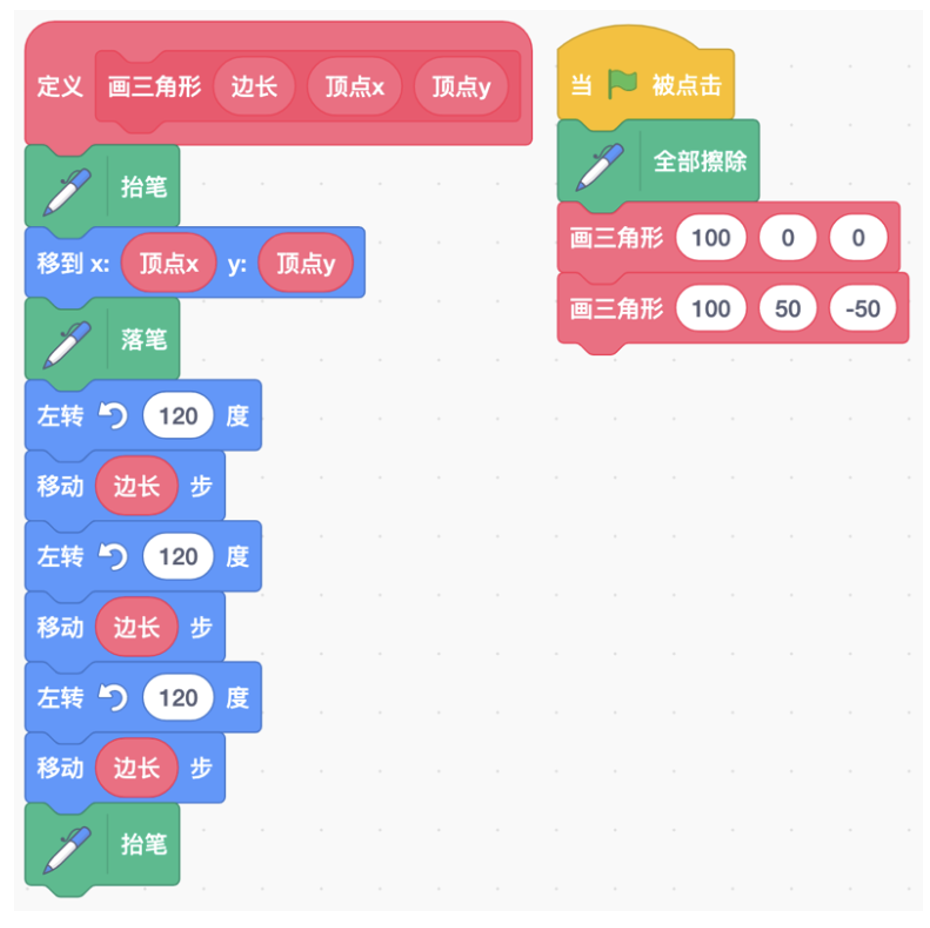

# 第7讲 过程：程序的模块化

## 一、	知识点

**(1) 什么是过程？** 

程序里有时会有重复的代码。例如，我想画两个三角形，于是写了图 7-1 所示的这段代码:

图 7-1 画两个三角形的程序(左)及运行结果(右)

运行这段代码的确可以画出两个三角形，不过这段代码太长了，而且有很 多重复:画第二个三角形时，又把画第一个三角形的代码重复了一遍，只是简 单地改动了几个数字。
那么有没有简洁的方案呢?

有，“过程”就是解决这种问题的简洁方案:我们首先把画一个三角形这 段代码抽出来，构成一个模块，这个模块就叫“过程”;然后我们只需要调用 这个过程两次就可以了。

什么叫“调用”一个过程呢?调用一个过程就是“ copy+paste ”，就是把 这个过程里面的指令复制一份，然后粘贴过来。好理解吧?如果这个过程中还 有参数，会复杂一点，我们一会儿仔细介绍。

图 7-2 制作新的“画三角形”积木块

**（2）	在 Scratch 程序里怎样实现过程? **

**（3）	调用一个过程时到底发生了什么? **

......
详细内容请参见书的第7讲。

## 二、动手练

**实验一：** 会织网的蜘蛛

**实验目的：** 

模仿蜘蛛织网的过程，一圈一圈地织出六边形的网来。 

**基本思路：** 
蜘蛛网可以看成由许多同样的几何图形构成:蜘蛛网的一圈为六边形，一个六 边形可以分割成 6 个三角形;整个网可以看成六边形的圈从里到外逐渐扩大形成。

图 7-4 画蜘蛛网的程序及实验结果

**代码下载** 

[画蜘蛛网的程序](Code/第7讲-蜘蛛网.sb3) 

--- 

**实验二：** 彩虹风车

**实验目的：** 

画一个带有彩虹叶片的风车。

提示：我们可以一个叶片一个叶片地画，一个叶片就是一个三角形。为了看上去
漂亮一点儿，每个叶片我都画了好几个三角形，每个三角形换一种颜色，这样 整个叶片看起来就像彩虹一样(见图 7-5)。

图 7-5 带有彩虹叶片的风车
**代码下载** 

[画彩虹风车的程序](Code/第7讲-风车.sb3) 

## 四、教师点评
解决复杂问题的基本思路有两点:

● 第一点是分解:我们把复杂问题分解成很多小的问题，分别独立地解决
各种小问题，然后合并起来后就解决了最初的大问题。例如，建房子可 分解为制作墙壁、制作门框、制作窗户、制作屋顶，把这些步骤拼起 来，就可以建一幢房子。

● 第二点是抽象:所谓抽象，就是概括。以图 7-3 为例，积木块的名字 “画三角形”就是概括。是谁的概括呢?就是对它下面那些指令的概括。

图 7-3 用“画三角形”积木块(左)实现画两个三角形的程序(右)

除了把脚本变简洁之外，定义过程还有其他的好处:有助于厘清思路;复 杂的程序需要多个人一起完成，我们把程序划分成一个一个的过程(叫作“模 块化”)，再定义好过程之间的接口，每个人就可以独立开发了。

在动手练的实验里，我们把“画蜘蛛网”拆分成“画六边形”模块，并进 一步拆分成“画三角形”模块。在课后作业的实验里，我们把“画彩虹风车” 拆分成“画单色风车”模块，并进一步拆分成“画三角形”模块。通过这两个 实验的锻炼，孩子们基本上掌握了“分解”和“抽象”的思维方式。

调用一个过程时到底发生了什么呢?就是一个三部曲:复制、粘贴、参数 替换。这样一来，孩子们就很容易掌握了。当然，还有一些复杂的地方，就是 递归过程，这个等到后面再仔细讲。
 

[返回上级](index.md)

