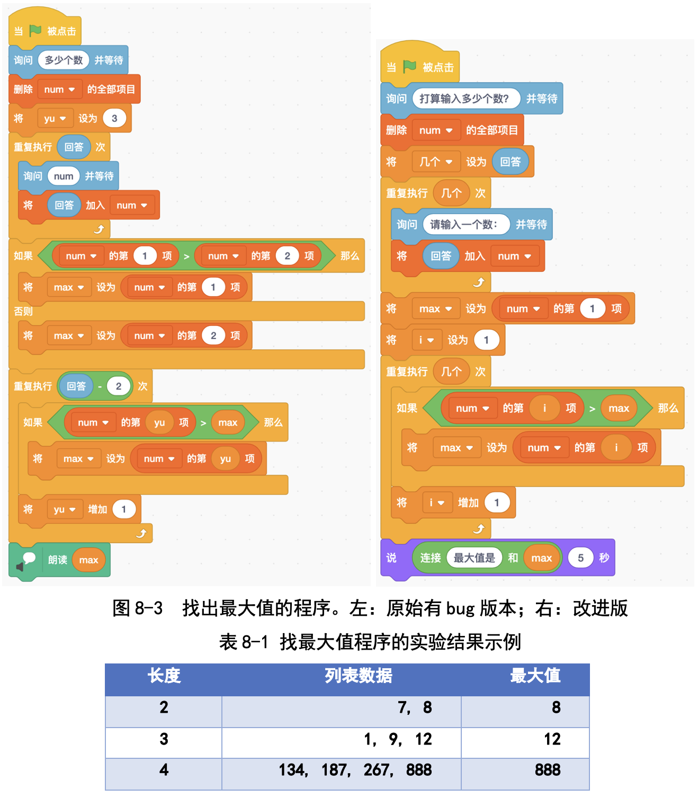

# 第8讲 列表:把几个变量合起来

## 一、	知识点

### （1）什么是列表? 为什么要用列表? 

我们已经学过了用变量保存数据。那我们来看看下面这个问题:假如你开 了一家咖啡店，想记录一年里每天卖出去几杯咖啡，那该怎么办呢?

一种办法是建立 365 个变量，比如第 1 天卖出的咖啡的杯数、第 2 天卖出 的咖啡的杯数、......、第 365 天卖出的咖啡的杯数。每个变量中保存一天的数 据，每卖出一杯咖啡，就把相应的变量值增加 1。

这种方法虽然正确，不过很麻烦:光是建立 365 个变量就很累，更不用说 当修改变量的值时，得先找准变量了。

遇到这种情况时，列表是一个好的解决方案。列表，也叫作数组，顾名 思义，就是我们把同类型的变量合在一起，做成一个表格。以上面的问题为 例，我们建立一个列表，名字为“每天卖出的咖啡数量表”;这个列表有 365 项，第 1 项保存第 1 天卖出的咖啡的杯数，第 2 项保存第 2 天卖出的咖啡的杯 数......这样就方便多啦!

图 8-1 用列表记录全年 365 天每天卖出的咖啡的杯数

### （2）	怎样理解列表? 

列表是存放很多变量的容器。打个比方，列表就像是一列高铁，列表里的 项就是高铁的车厢。我们乘坐高铁时需要知道自己在几号车厢，访问列表时也一样，需要指明要用第几项中保存的数据。

......

其他内容请参见书的第8讲。

## 二、动手练

### 实验一：  找出最大值和最小值

#### 实验目的： 

用列表保存数据，并计算出最大值和最小值。

#### 基本思路： 

先初始化最大值和最小值，然后和每一项逐个比较，在比较过程中进行 更新。

#### 代码下载 

[计算最大最小值的代码](Code/第8讲-计算最大最小值-修正版.sb3) 

--- 

### 实验二：计算列表中数据的平均值

#### 实验目的： 

用列表保存数据，并计算出平均值。

提示： 我们先计算出数据的总和，然后除以项目数，就得到平均值了。

#### 代码下载

[计算平均值的代码](Code/第8讲-计算平均值.sb3) 

## 四、教师点评

列表(数组)是计算机程序设计中的基本概念，就是把多个数组织在一起。 孩子们把“列表和项”想象成“列车和车厢”，很直观、很形象。

我们从“笨方法”开始，再看用了列表会大大简化，一对比就明白列表的 作用了。

[返回上级](index.md)

