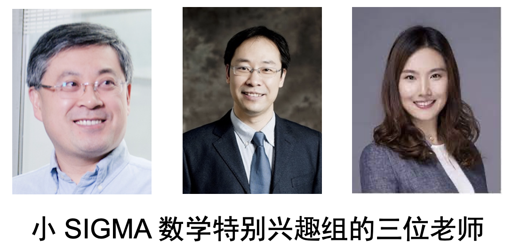

# 教师的话

 

左：卜东波，中科院计算所研究员；研究方向：计算机算法设计、生物信息学；提出了逆向蒙特卡罗采样算法、蛋白质结构预测算法ProFOLD；在国科大讲授《算法设计与分析》，讲授如何观察问题、如何根据观察设计算法求解问题

中：包云岗，中科院计算所研究员；研究方向：计算机系统；负责国科大“一生一芯”实践计划；在国科大讲授《操作系统》，讲授如何设计CPU和计算机系统

右：兰艳艳，清华大学教授、前中科计算所研究员；研究方向：统计学、机器学习，排序学习的代表性人物；在国科大讲授《人工智能与机器学习》，教计算机如何学习

---

## 一
2018年的一天，我给我的同事包云岗打了个电话，说：“孩子们三年级了；能否有一个轻松、活泼的氛围，引导孩子们学一些数学思维？”云岗很赞同；我们就一起组织了一个SIGMA数学特别兴趣组，由包云岗、兰艳艳和我来当老师，学员就是我们自己的孩子们。

在SIGMA班上，学生用书是通行的奥数教材，不过教师用书可不太普通，我们用的是G. Polya写的《怎样解题---数学思维的新方法》和陶哲轩写的《陶哲轩教你学数学》。换句话说，我们践行的是Polya的数学教育观：重在倾听孩子们的理解和猜想，重在引导孩子们观察、尝试、做“合情推理”。总之是一种“慢数学”的风格，有时候甚至2个小时只讲一道题。

一开始看不出成效；等到三年下来，才慢慢发现孩子们有了些进步---当然，这些进步不是指孩子们参加某个杯赛拿了个奖，而是指孩子们掌握了一些基本的数学思维，体现在自己能够提出和证明一些猜想，比如包若宁、卜文远、魏文珊小朋友提出了三阶幻方的“包卜魏猜想”、傅鼎荃小朋友学习“鸡兔同笼”问题时，完全自主地想出了“二分法”。思维火花迸发的时刻，孩子们非常兴奋，我们也非常欣慰；这是对我们最大的肯定和奖赏。

## 二
等到了2020年春节，由于疫情的原因，孩子们都憋在家里，很无聊，就嚷嚷着让我们教她们编程。教一门编程语言容易，但是关键不在这里，而是在于教“计算思维”，这给我们出了一个不小的难题。

事实上，包云岗、兰艳艳和我都在中国科学院大学教计算机：包老师讲授“操作系统”，负责“一生一芯”实践计划，教同学们如何设计CPU和计算机系统；兰老师讲“机器学习和人工智能”，训练计算机怎样学习；我讲“计算机算法设计”，教同学们碰到问题时怎样观察问题的特点、怎样根据问题的特点设计算法。概而言之，我们教的都是“计算思维”。

不过我们在国科大教的都是本科生和研究生，能否教小学生计算思维？教什么？怎么教？这对我们来说是全新的挑战。这可不像数学，还有Polya和陶哲轩写的书能够当做教师用书，给我们一些指导。

我们在开课前想了很长时间，教的时候又边教边思考，把教授本科生、研究生的计算思维进行了裁剪和修改，形成了一个初步的“小学生版”计算思维。

我们的体会是：计算思维的核心，是碰到问题如何观察、如何尝试，最后如何根据观察到的规律设计程序求解问题。如下这几条，或许是最基本的计算思维方法：
1. **先正向尝试理解题意、再反向求解问题**：碰到一个问题如何下手？求解问题是“反向思维”，有时候的确不太容易一下子就想出来。这时孩子们往往手足无措、束手无策，对着问题发呆。

在这种情况下，“先正向尝试理解题意，再反向求解问题”，是走出困境的一个好办法。比如“鸡兔同笼”问题，可以尝试一下有0只鸡，即使这个尝试非常的粗糙，然后验证这个尝试对不对，不对再修改尝试，比如尝试看看有1只鸡对不对，如果不对再增加鸡的数目。这种尝试看起来很笨，不过却有三个好处：一是能够使得孩子们动起手来了，避免了发呆；二是起码能够启发我们写一个求解的程序了；第三点更重要，尝试不了几次，孩子们就自己发现出规律来，就自己想出来更好的求解方法。

先尝试猜测一个解（或许这个解很粗糙，这不要紧），再验证是否满足要求，不满足要求就改。这种“尝试-验证-改进”策略是“试错法”，也是“逐步改进法”。正向尝试有助于孩子们理解题意，或许应该成为孩子们碰到问题的“第一反应”。

说得更远一点儿，计算机科学与技术里普遍采用这种“用正向尝试来反向解题”策略。一个典型的就是神经网络的训练过程---尝试设置网络参数，做正向的网络传播，验证传播的结果，如果不好就修正网络参数，最终反向求解出网络参数。

2. **从最简单的做起**：碰到一个复杂的问题怎么办？比如“四个和尚分馍馍”问题：唐僧师徒4人化缘化到了10个馍馍，问共有几种分法？孩子们没学过组合数学，看到这么多和尚、这么多馍馍，一下子就傻眼了。

直接求解这个问题是很难的。我们启发孩子们从最简单的做起：4个和尚、10个馍馍不会做，那就先考虑2个和尚、1个馍馍。反过来说，如果这个最简单的情形都不会做，说明这个问题太难了，要么放弃，要么琢磨最简单的情形与原始问题之间的差异。

当知道怎样求解2个和尚、1个馍馍的问题之后，我们再增加难度，考虑2个和尚、2个馍馍的问题，以及3个和尚3个馍馍的问题。

找出问题的最简单情形，从最简单的情形入手，可以有效地避免孩子们面对一个复杂问题时的束手无策。所谓下手，所谓破题，所谓“把手弄脏”，这是第二个有效的方式。

3. **要学会把复杂问题分解成简单问题**：这和上一点是一脉相承的。当面对复杂问题时，首先要思考什么是最简单情况，最简单情况会不会做；假如最简单情况会做了，下面的思考方向就是如何把复杂问题分解成简单问题。

还是拿“4个和尚分10个馍馍”做例子，假如知道了唐僧吃了1个馍馍，剩下的问题就简化成“3个和尚分9个馍馍”了。把复杂的问题分解成简单的“同类型的问题”，这是递归思维。

当然了，这种“假设法”只是一种问题分解手段，除此之外，还有“二分法”等。我们设计几个题目，比如“求2的平方根”，就是想引导孩子们学习“二分法”的。

4. **枚举容易做、关键是剪枝**：如果说计算思维和数学思维有什么不同，我想最大的不同或许在于“枚举法”。其中的道理很简单：人力有限，惧怕枚举；计算机不怕累，不怕枚举，反而有时候喜欢枚举---枚举程序多容易写啊。

以“数字谜”问题为例，解是多个变量的组合；求解这个问题的思路很简单：只需要枚举变量的所有取值组合就可以了。孩子们在奥数课也碰到这种题目，当时很畏难---不是不会做，而是所有的组合太多了，一想到枚举就发憷。不过到了编程课上就简单了，只需写个“嵌套循环”，让计算机拼命算就行了。

当然了，要是组合数实在太多的话，计算机也枚举不完。这时候的关键是找“最受限制”的变量，用这个变量对枚举树进行“剪枝”。我们在讲“数字谜”时，让孩子们尝试最笨的枚举，然后和带剪枝的枚举进行对比，从而体会剪枝的重要性。

同学们将来会发现很多问题和“数字谜”问题类似，解是由多个变量组成的。对这种问题，“枚举+剪枝”是行之有效的解题思路。

5. **随机是个利器**：孩子们还是小学生，接触的“确定性”方法多，接触的“随机性”算法少。我们设计了“蒲丰投针估计π”、“打圆形靶子估计π”以及“布朗运动和醉汉的脚步”，就是想引导孩子们用随机算法的角度思考问题。

在讲授这些方法时，我们不是让孩子们直接写程序，而是先动手做些物理实验。比如在写“打圆形靶子估计π”程序之前，先用圆珠笔作飞镖、向靶纸上投掷；在写“花粉的布朗运动”仿真程序之前，先用激光笔照射淀粉悬浮液，体会真实的布朗运动；在写“牛顿的大炮”程序之前，先用三根弹簧秤探索拉力分解的奥秘。有了真实的体会再写程序，和没有体会直接写，感觉是不一样的。

在分析这些实验的结果时，我们引导孩子们观察随机方法的好处：不用特别多的实验次数，就能得到很好的结果。这种随机采样策略能够大大减少计算量。

6. **仿真物理世界**：在学习计算思维的过程中，一个需要防止的倾向是把计算机世界和真实的物理世界割裂开来。为此，我们在设计题目时非常强调“数学建模”，即怎样把物理世界中的实际问题表示成计算机问题或数学问题。

比如我们设计了“森林里有几只老鼠几只猫头鹰”这一讲，意图引导孩子们体会如何仿真“猎物-捕食者”动力学系统；设计了“牛顿的大炮”这一讲，意图引导孩子们体会到如何把物理世界“装”到计算机里去。

值得说的是，“森林里有几只老鼠几只猫头鹰”背后有高深的数学；C. Lay写的《线性代数基础及应用》讲到矩阵特征值时，开篇用的就是这个例子。等到孩子们长大了，学习大学数学时，相信会有似曾相识的感觉。

总结一下，从粗糙的解开始大胆尝试，不断改进；从最简单的情形做起，把复杂问题分解成简单问题；枚举所有的解，设计“剪枝”技术加快枚举过程；随机采样少量的样本，以减少计算量---这大概就是计算思维最基本的几条了。我们给本科生、研究生讲的无非也是这几条，只不过是更深一些、更广一些罢了。

德国大数学家、数学教育家F. Klein写了一本书《高观点下的初等数学》，其核心观点之一是“有些基础数学，从高观点下才能看得更明白”。我们把讲述给本科生、研究生的计算思维做了剪裁，然后讲授给孩子们；不揣浅陋得讲，这或许可以称作“高观点下的计算思维”吧。

为了便于孩子们理解和掌握计算思维，我们还自己设计了一些游戏，比如“找钻石”游戏是为了体会“二分法”、“走迷宫”游戏是为了体会陶哲轩提出的解题大法---解题无非是尝试寻找一条从已知到结论的路径。我们几位老师平时研究的是算法和系统，所以我们给小SIGMA们讲授的“计算思维”，带有很浓厚的“数学思维”和“系统思维”色彩。

我们在讲授时还穿插了一些科技史，比如Grace Hopper发现的第一个bug、朱载堉算出的2的12次方根与钢琴等---讲历史不是为了训诂，而是试图引导学习者尽力把自己“代入”到亲历者当时的情景，揣摩他/她的智识水平和当时所面临的挑战，才能更深刻地领会他/她的创见和思维过程，才能在自己碰到问题时有所启发。
		
## 三
大概花了4个月的时间，我们就教完孩子们编程了，包括编程基础知识和计算思维。那孩子们学的到底怎么样呢？

事情很凑巧---整整一年之后的2021年5月22日，我们所里举办“公众科学日”活动，其中一个节目是我带着小SIGMA们做一期“知乎课堂”，讲的题目是“如何用Scratch编程实现一只阿尔法小狗”。台下有300名现场观众注视，线上还有30万观众观看，孩子们顶住压力，现场编程，出了bug现场debug，最终实现了会下tic-tac-toe棋的阿尔法小狗；然后给观众讲解了背后的原理和编程步骤，并邀请了观众小朋友进行“人狗大战”。完成现场编程和讲解，说明孩子们掌握了基本的计算思维和程序设计技能。此外，张秦汉小朋友参加“核桃杯”编程大赛，获得了北京市金奖，也是一个小小的证明。

## 四
我们在讲课的同时就要求孩子们做笔记，记录自己的理解、实验设计和实验结果。孩子们轮流来，每一讲都由一位小朋友负责整理笔记：写程序、写结果、上网查补充材料，通常需要花费一周的时间。孩子们写完之后，由我们修改、校补和点评，最终汇集成了这本小册子。我们所做的大修改都以“补充材料”的形式明确标识；我们尽量把修改最小化，以保持孩子们写作的原滋原味---童言童语，自当胜过老生常谈。

这本书是我们和孩子们的共同劳动成果：封面是刘卫玲精细设计的；校对是由包云岗、张春明、谭光明、兰艳艳、何海芸共同完成的。每一位家长都没有缺席。
在我的心目中，SIGMA特别兴趣组不是一个课外补习班，而是我们这些做父母的和孩子们玩儿的一场亲子游戏，是把我们的思考和领悟教给孩子们的一次传承，是共同领略数学思维和计算思维的一次探秘之旅。

我想我们这些家长们会永远记得这段时光；我想孩子们将来上了大学，学到高等数学、概率论、计算机算法、人工智能时，应该时不时会发现似曾相识，大道至简，当会心一笑罢。

是为记。 
  

[返回上级](index.md)
