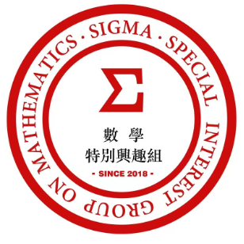
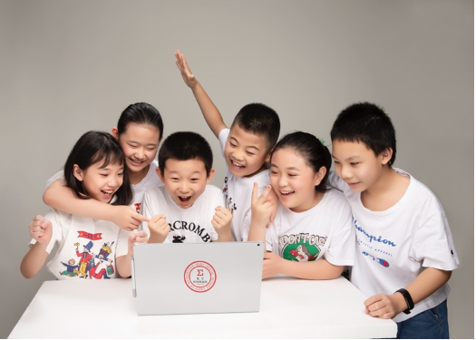
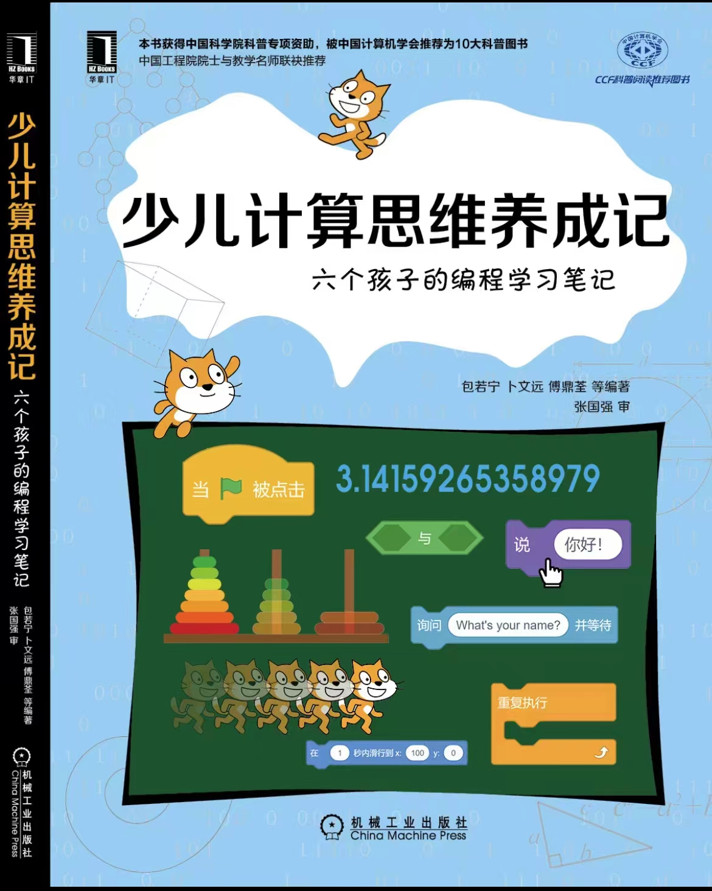

# 少儿计算思维养成记---六个小孩的编程学习笔记

小SIGMA数学特别兴趣组成立于2018年，有6名学生，分别是包若宁、卜文远、傅鼎荃、魏文珊、谭沛之和张秦汉。那时候我们都是9岁左右，上三年级。我们有3位老师：卜东波老师、包云岗老师和兰艳艳老师。

我们这个SIGMA特别兴趣组主要讲数学。我们最大的特点是“慢慢讲”，有时候两个小时才讲一道题。这让我们有足够的时间去思考、去尝试，去发现一些好玩的规律。比如讲幻方时，包若宁、卜文远和魏文珊提出了“包卜魏猜想”---已知三阶幻方的中心格子、左上角、左侧中间格子的三个数时，这个三阶幻方就完全确定了。还有在学“鸡兔同笼”时，傅鼎荃自发地想出了“二分法”。

2020疫情期间，大家在家里都闷得无聊，便组织了编程课。当我们看到一个个美丽的角色、像积木一样的积木块时，我们便深深地爱上了编程。编程像一扇新世界的大门，等着我们去发现。在编程里，似乎所有事情都能实现；于是我们想到什么事情就编程试一下。比如在疫情的时候，卜文远自发尝试写了一个小程序，用小球模拟病毒的传播。

在学习编程的这3个月里，我们一起写过好多的程序，有四个和尚分馍馍、算π、二分法找钻石……。在这么多程序中，最好玩儿的就是阿尔法小狗了！这只小狗会下井字棋；它本领高强，每次我们都赢不了它！

我们发现编程可以解决许多数学问题，比如数学里的鸡兔同笼、估算2的平方根等。我们还可以写个程序估计森林里的猫头鹰和老鼠的数目。模拟世界的感觉很奇妙！
我们写这本书时最初的想法是：大部分编程书都是大人写的，都是以大人的视角来看的。我们想以孩子的视角写一本编程书，于是我们便一人写几章，把学习心得记录下来，最终形成了这本书。

我觉得这本书和其他书是不一样的，它记录的是每一位小作者对每讲的看法与总结，记录我们每个编程初学者对程序从陌生到熟悉并形成自己思维的过程，我们也希望我们的经历可以帮助更多的初学小朋友爱上编程和计算思维。
我们写的程序都放在[这个网址](https://deltadbu.github.io/6kids_learning_scratch/)上，供大家参考。

希望你能喜欢这本书啊！

[序（作者：徐志伟研究员）](Preface.md)

[教师的话（一）](TeachersWords.md)

[教师的话（二）](TeachersWords2.md)

## 视频

[如何用Scratch实现一只阿尔法小狗？(2021年度计算所“公众科学日”知乎课堂)](http://bioinfo.ict.ac.cn/~dbu/Video/SIGMA-MiniAlphaGo.mp4)

## 编程基础篇
---

第一讲 [什么是计算机程序？](Lec1.md)

第二讲 [角色的动作、绘图和音乐演奏](Lec2.md)

第三讲 变量：角色的记忆	

第四讲 循环：重复做动作

第五讲 克隆：角色的双胞胎和多胞胎

第六讲 条件判断：角色根据情况做动作	

第七讲 过程：程序的模块化	

第八讲 列表：把几个变量合起来	

第九讲 字符串：把几个字母合起来	

第十讲 收发消息：角色之间的沟通和协调	

## 计算思维篇
---

第十一讲 逐级逼近法：刘徽割圆法估计Π	

第十二讲 聪明的枚举：巧解数字谜	

第十三讲 再论聪明的枚举：三阶幻方

第十四讲 从最简单的做起：4个和尚分馍馍

第十五讲 用“试错法”求解鸡兔同笼问题

第十六讲 随机有威力：打圆形靶子估计Π

第十七讲 再论随机有威力：打圆形靶子估计Π

第十八讲 玩游戏体会“递归法”：河内塔游戏

第十九讲 “递归法”的应用：斐波那契数列与黄金分割

第二十讲 玩游戏体会“搜索法”：走迷宫

第二十一讲 玩游戏体会“二分法”：找钻石

第二十二讲 “二分法”的应用：估计2的平方根

第二十三讲 仿真世界：牛顿的大炮

第二十四讲 再论仿真世界：森林里有几只老鼠、几只猫头鹰？

第二十五讲 博弈初探：会下TIC-TAC-TOE棋的阿尔法小狗

[后记](Afterword.md)

